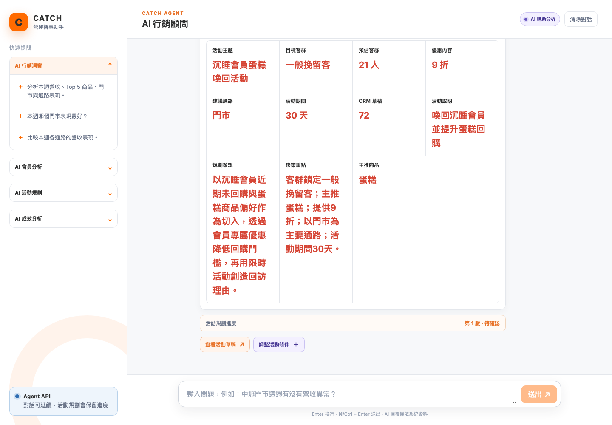
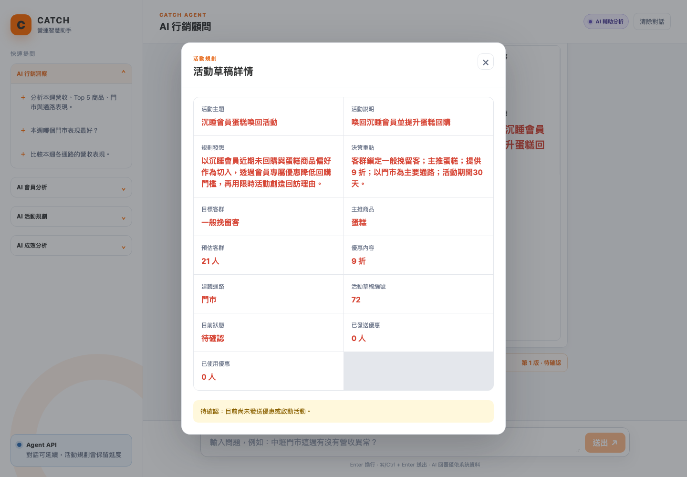
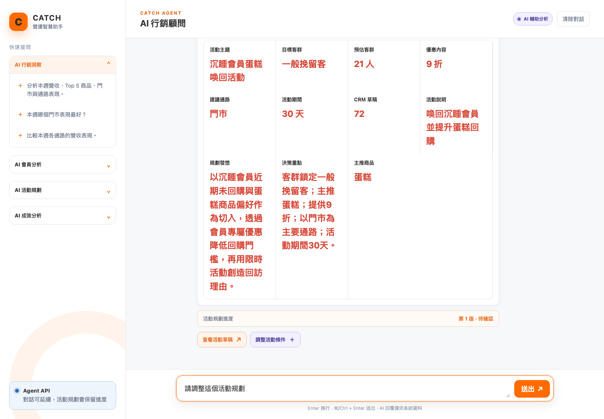
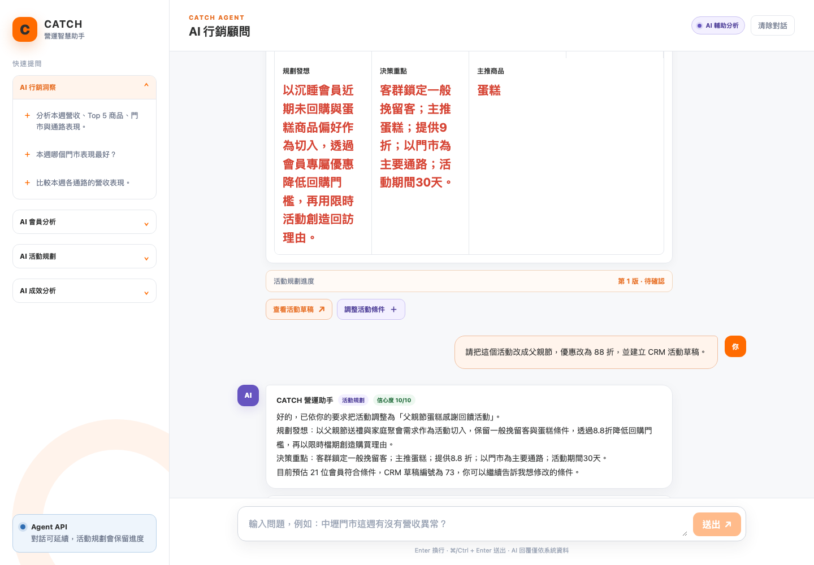
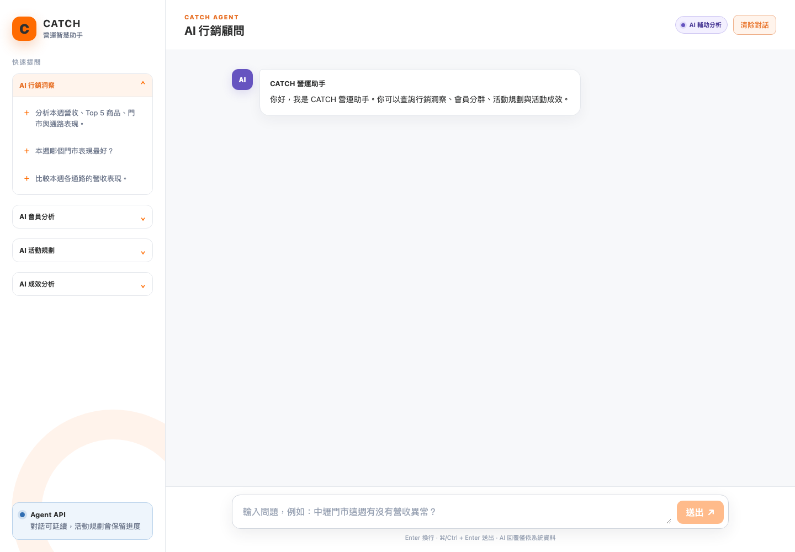
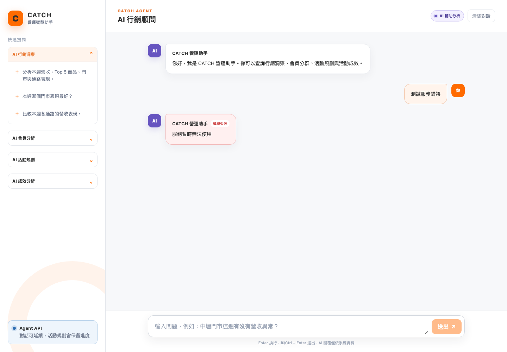

# AI 行銷規劃 Demo｜Frontend E2E 測試報告

- 測試時間：2026-08-13T15:52:10
- 測試入口：`http://127.0.0.1:5176`
- 測試範圍：快速提問、AI 行銷規劃字卡、活動草稿詳情、同一對話調整活動、狀態保存、清除對話、API 錯誤呈現
- 驗收結果：**通過**

## 測試摘要

| Flow | 結果 |
| --- | --- |
| 首頁與輸入框 | PASS |
| AI 行銷規劃字卡 | PASS |
| 查看活動草稿 | PASS |
| 同一對話調整活動條件 | PASS |
| 對話與活動進度保存 | PASS |
| 清除後重新開始新對話 | PASS |
| 清除對話 | PASS |
| API 錯誤訊息 | PASS |

## 流程截圖

### 1. 首頁：歡迎訊息、快速提問與輸入框


### 2. 頁面重新整理：還原已保存的對話與活動進度


### 3. AI 行銷規劃：活動字卡與操作按鈕



### 4. 活動草稿詳情：顯示活動摘要與待確認狀態



### 5. 調整活動條件：操作按鈕帶入輸入框，等待使用者補充



### 6. 將活動改成父親節後重新送出：取得新的活動規劃字卡



### 7. 清除對話：回到初始狀態



### 8. API 失敗：顯示可理解的錯誤訊息



## 實際驗證資料

- CRM 草稿編號：`72`
- CRM 最新狀態：`draft`，客群 `21` 人，已發送 `0` 人，已使用 `0` 人
- 對話識別碼：`conv_8b2aa46dad794dd2bb72e55eba9a8564`
- 活動規劃版本：`2`
- 已保存訊息數：`4`
- 字卡內容：AI 行銷活動規劃；已依客群條件完成 CRM 預覽並建立活動草稿。；活動主題；沉睡會員蛋糕喚回活動；目標客群；一般挽留客；預估客群；21 人；優惠內容；9 折；建議通路；門市；活動期間；30 天；CRM 草稿；72；活動說明；喚回沉睡會員並提升蛋糕回購；規劃發想；以沉睡會員近期未回購與蛋糕商品偏好作為切入，透過會員專屬優惠降低回購門檻，再用限時活動創造回訪理由。；決策重點；客群鎖定一般挽留客；主推蛋糕；提供9 折；以門市為主要通路；活動期間30天。；主推商品；蛋糕
- Browser page errors：`0`
- Console errors：`0`
- Transient API console errors：`0`
- Console warnings：`0`
- Expected API console errors：`1`

## 測試命令

```bash
npm run e2e:marketing
```
