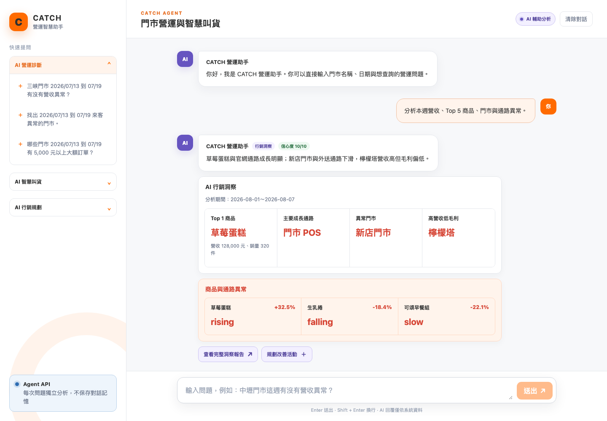
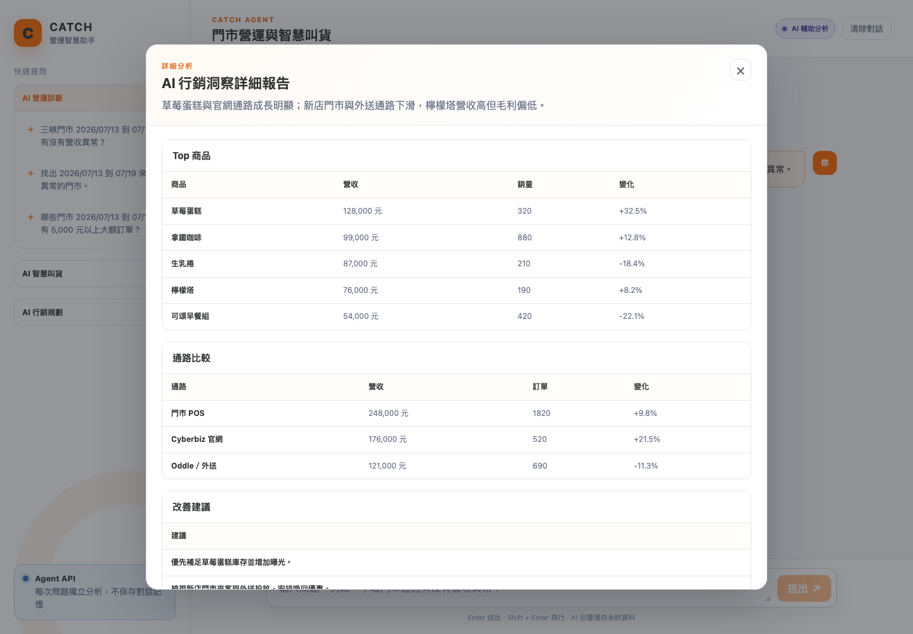
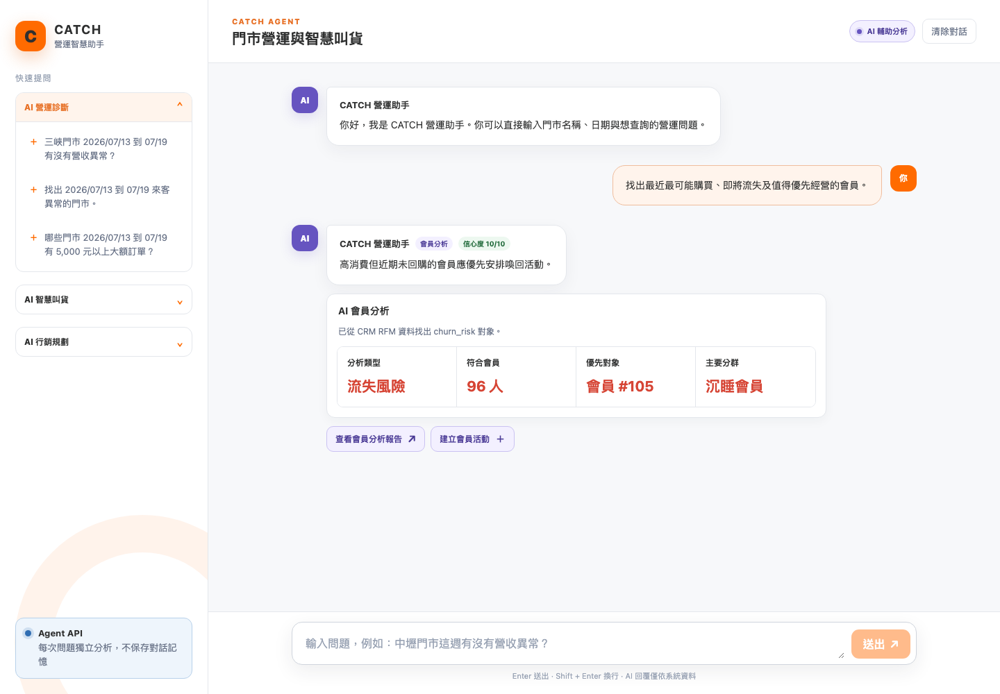
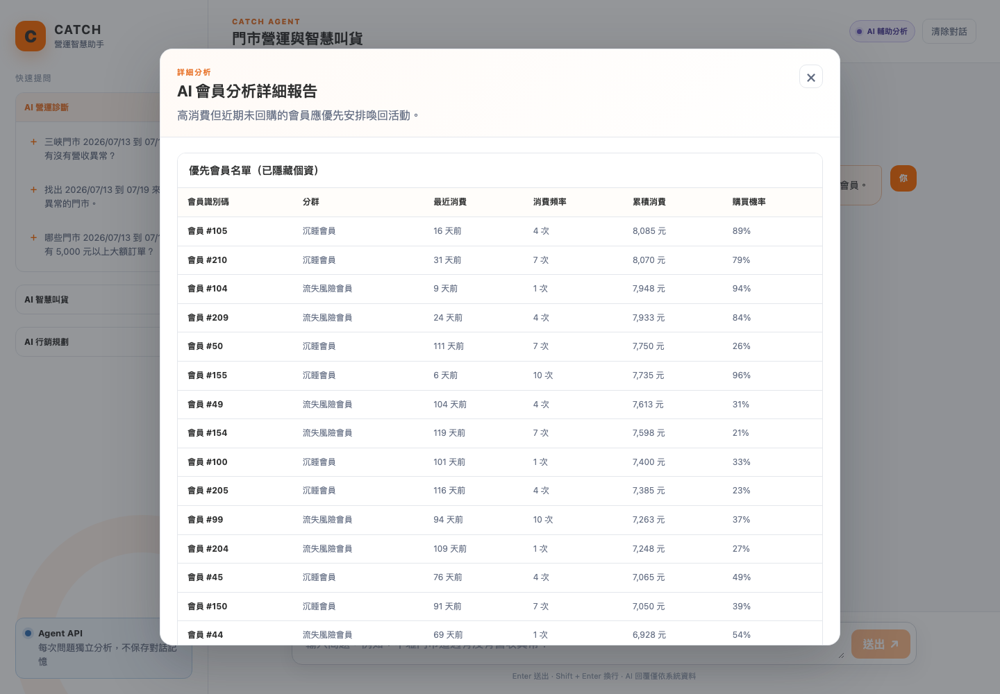
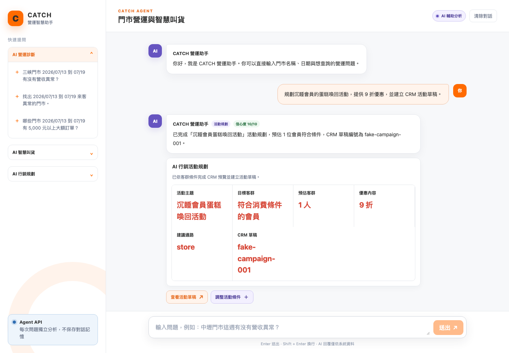
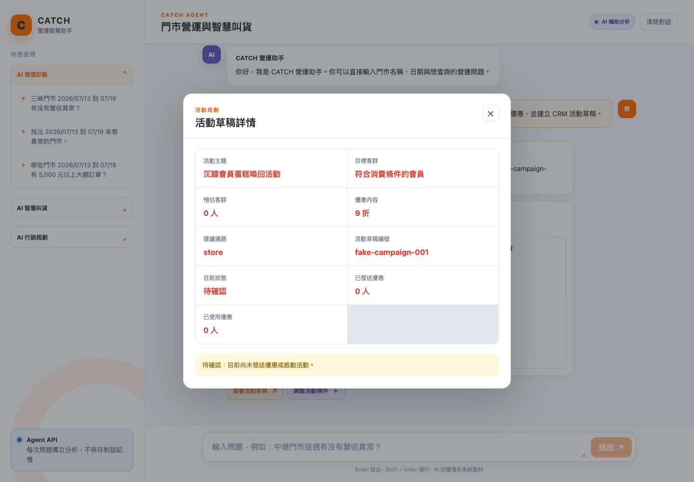
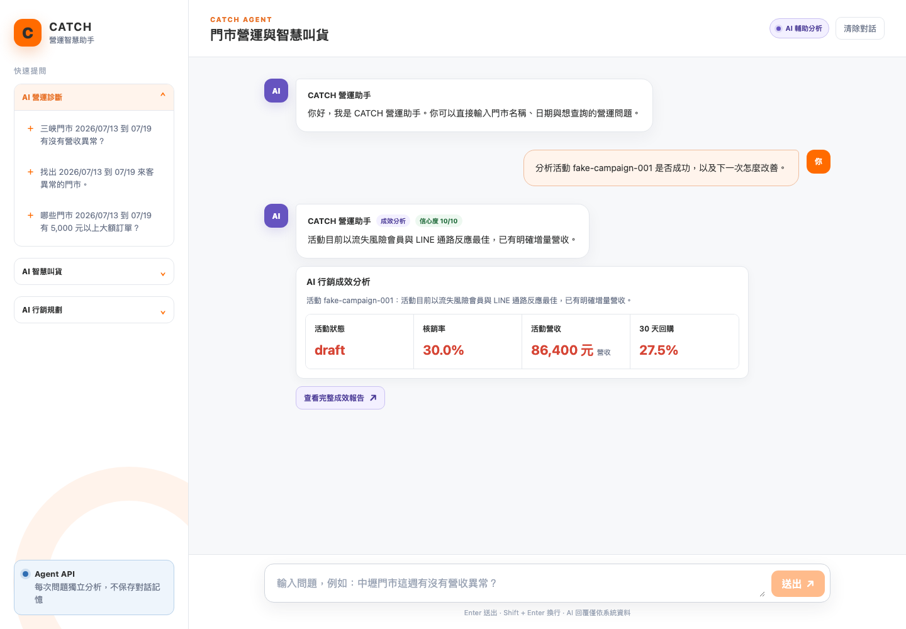
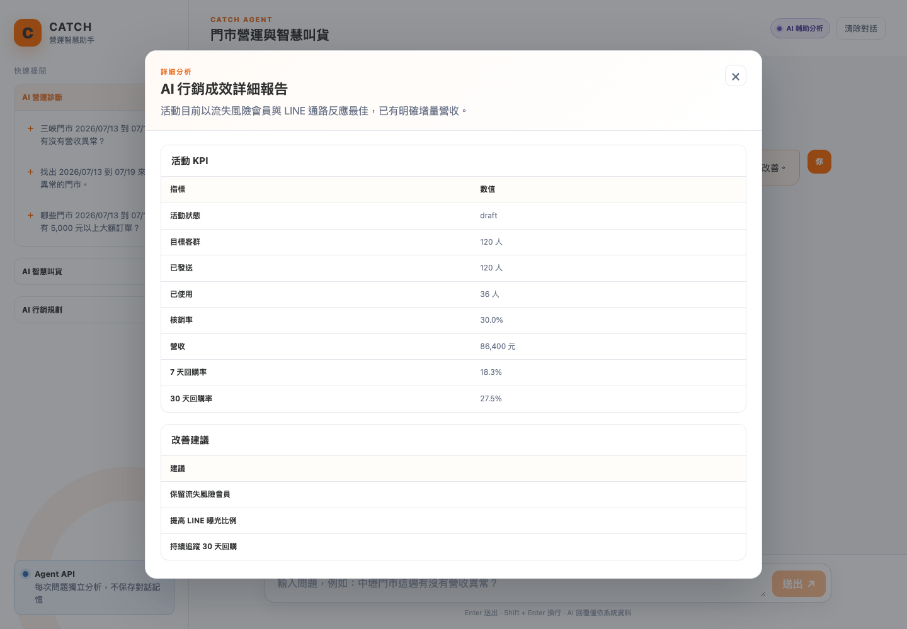

# AI 行銷顧問 Agent｜四情境 E2E 測試報告

- 測試時間：2026-08-12T10:44:53
- 測試入口：`http://127.0.0.1:5174`
- CRM Demo 模式：由 Agent backend 的 CRM Adapter 提供可重現測試資料
- 驗證內容：AI 行銷洞察、AI 會員分析、AI 行銷活動建議、AI 行銷成效分析

## 結果

| 情境 | 結果 |
| --- | --- |
| AI 行銷洞察 | PASS |
| AI 會員分析 | PASS |
| AI 行銷活動建議 | PASS |
| AI 行銷成效分析 | PASS |

## 逐情境對話紀錄

## AI 行銷洞察

### 步驟 1｜使用者輸入與 API 請求

- 對話輸入：`分析本週營收、Top 5 商品、門市與通路異常。`
- API：`POST /api/v1/agent/query`

```json
{
  "message": "分析本週營收、Top 5 商品、門市與通路異常。",
  "timezone": "Asia/Taipei",
  "context": {
    "store_codes": []
  }
}
```

### 步驟 2｜Agent API 回傳

- resolved tool：`analyze_marketing_insights`
- resolved task：`marketing_insights`
- 回覆文字：草莓蛋糕與官網通路成長明顯；新店門市與外送通路下滑，檸檬塔營收高但毛利偏低。
- 信心度：`10/10`

```json
{
  "resolved_intent": {
    "task": "marketing_insights",
    "tool": {
      "tool": "analyze_marketing_insights"
    }
  },
  "reply": {
    "text": "草莓蛋糕與官網通路成長明顯；新店門市與外送通路下滑，檸檬塔營收高但毛利偏低。",
    "confidence": 10,
    "cards": [
      {
        "type": "marketing_insight",
        "title": "AI 行銷洞察",
        "description": "分析期間：2026-08-01～2026-08-07",
        "items": [
          {
            "label": "Top 1 商品",
            "value": "草莓蛋糕",
            "unit": null,
            "change_pct": null,
            "status": "normal"
          },
          {
            "label": "主要成長通路",
            "value": "門市 POS",
            "unit": null,
            "change_pct": null,
            "status": "normal"
          },
          {
            "label": "異常門市",
            "value": "新店門市",
            "unit": null,
            "change_pct": null,
            "status": "anomaly"
          },
          {
            "label": "高營收低毛利",
            "value": "檸檬塔",
            "unit": null,
            "change_pct": null,
            "status": "anomaly"
          }
        ]
      },
      {
        "type": "anomaly_list",
        "title": "商品與通路異常",
        "description": null,
        "items": [
          {
            "label": "草莓蛋糕",
            "value": "rising",
            "unit": null,
            "change_pct": "+32.5%",
            "status": "anomaly"
          },
          {
            "label": "生乳捲",
            "value": "falling",
            "unit": null,
            "change_pct": "-18.4%",
            "status": "anomaly"
          },
          {
            "label": "可頌早餐組",
            "value": "slow",
            "unit": null,
            "change_pct": "-22.1%",
            "status": "anomaly"
          }
        ]
      }
    ],
    "actions": [
      {
        "type": "open_report",
        "label": "查看完整洞察報告",
        "payload": {
          "report_id": "insight-2026-08-01-2026-08-07"
        }
      },
      {
        "type": "continue_chat",
        "label": "規劃改善活動",
        "payload": {
          "message": "根據剛才的洞察規劃一個改善活動"
        }
      }
    ],
    "reports": [
      {
        "report_id": "insight-2026-08-01-2026-08-07",
        "title": "AI 行銷洞察詳細報告",
        "summary": "草莓蛋糕與官網通路成長明顯；新店門市與外送通路下滑，檸檬塔營收高但毛利偏低。",
        "section_titles": [
          "Top 商品",
          "通路比較",
          "改善建議"
        ]
      }
    ]
  }
}
```

### 步驟 3｜觸發字卡

#### `marketing_insight`｜AI 行銷洞察

分析期間：2026-08-01～2026-08-07

| 欄位 | 回傳值 | 狀態 |
| --- | --- | --- |
| Top 1 商品 | 草莓蛋糕 | normal |
| 主要成長通路 | 門市 POS | normal |
| 異常門市 | 新店門市 | anomaly |
| 高營收低毛利 | 檸檬塔 | anomaly |

#### `anomaly_list`｜商品與通路異常

無額外說明

| 欄位 | 回傳值 | 狀態 |
| --- | --- | --- |
| 草莓蛋糕 | rising（+32.5%） | anomaly |
| 生乳捲 | falling（-18.4%） | anomaly |
| 可頌早餐組 | slow（-22.1%） | anomaly |

### 步驟 4｜可操作按鈕

| 按鈕文字 | action type | payload |
| --- | --- | --- |
| 查看完整洞察報告 | `open_report` | `{"report_id": "insight-2026-08-01-2026-08-07"}` |
| 規劃改善活動 | `continue_chat` | `{"message": "根據剛才的洞察規劃一個改善活動"}` |

### 步驟 5｜按鈕後續畫面

- 點擊按鈕：`查看完整洞察報告`
- 報告標題：AI 行銷洞察詳細報告
- 報告摘要：草莓蛋糕與官網通路成長明顯；新店門市與外送通路下滑，檸檬塔營收高但毛利偏低。

| 報告區塊 | 欄位 | 資料筆數 | 前 5 筆資料 |
| --- | --- | ---: | --- |
| Top 商品 | 商品、營收、銷量、變化 | 5 | 草莓蛋糕／128,000 元／320／+32.5%；拿鐵咖啡／99,000 元／880／+12.8%；生乳捲／87,000 元／210／-18.4%；檸檬塔／76,000 元／190／+8.2%；可頌早餐組／54,000 元／420／-22.1% |
| 通路比較 | 通路、營收、訂單、變化 | 3 | 門市 POS／248,000 元／1820／+9.8%；Cyberbiz 官網／176,000 元／520／+21.5%；Oddle／外送／121,000 元／690／-11.3% |
| 改善建議 | 建議 | 3 | 優先補足草莓蛋糕庫存並增加曝光。；檢視新店門市來客與外送投放，安排喚回優惠。；將檸檬塔改為組合促銷，避免單品折扣侵蝕毛利。 |

- 對應截圖：`advisor_screenshots/01_insights_card.png`
- 後續畫面截圖：`advisor_screenshots/01_insights_report.png`

## AI 會員分析

### 步驟 1｜使用者輸入與 API 請求

- 對話輸入：`找出最近最可能購買、即將流失及值得優先經營的會員。`
- API：`POST /api/v1/agent/query`

```json
{
  "message": "找出最近最可能購買、即將流失及值得優先經營的會員。",
  "timezone": "Asia/Taipei",
  "context": {
    "store_codes": []
  }
}
```

### 步驟 2｜Agent API 回傳

- resolved tool：`analyze_member_segments`
- resolved task：`member_analysis`
- 回覆文字：高消費但近期未回購的會員應優先安排喚回活動。
- 信心度：`10/10`

```json
{
  "resolved_intent": {
    "task": "member_analysis",
    "tool": {
      "tool": "analyze_member_segments"
    }
  },
  "reply": {
    "text": "高消費但近期未回購的會員應優先安排喚回活動。",
    "confidence": 10,
    "cards": [
      {
        "type": "member_analysis",
        "title": "AI 會員分析",
        "description": "已從 CRM RFM 資料找出 churn_risk 對象。",
        "items": [
          {
            "label": "分析類型",
            "value": "流失風險",
            "unit": null,
            "change_pct": null,
            "status": "info"
          },
          {
            "label": "符合會員",
            "value": "96 人",
            "unit": null,
            "change_pct": null,
            "status": "normal"
          },
          {
            "label": "優先對象",
            "value": "會員 #105",
            "unit": null,
            "change_pct": null,
            "status": "info"
          },
          {
            "label": "主要分群",
            "value": "沉睡會員",
            "unit": null,
            "change_pct": null,
            "status": "info"
          }
        ]
      }
    ],
    "actions": [
      {
        "type": "open_report",
        "label": "查看會員分析報告",
        "payload": {
          "report_id": "member-churn_risk"
        }
      },
      {
        "type": "continue_chat",
        "label": "建立會員活動",
        "payload": {
          "message": "根據這份會員名單建立行銷活動"
        }
      }
    ],
    "reports": [
      {
        "report_id": "member-churn_risk",
        "title": "AI 會員分析詳細報告",
        "summary": "高消費但近期未回購的會員應優先安排喚回活動。",
        "section_titles": [
          "優先會員名單（已隱藏個資）",
          "經營建議"
        ]
      }
    ]
  }
}
```

### 步驟 3｜觸發字卡

#### `member_analysis`｜AI 會員分析

已從 CRM RFM 資料找出 churn_risk 對象。

| 欄位 | 回傳值 | 狀態 |
| --- | --- | --- |
| 分析類型 | 流失風險 | info |
| 符合會員 | 96 人 | normal |
| 優先對象 | 會員 #105 | info |
| 主要分群 | 沉睡會員 | info |

### 步驟 4｜可操作按鈕

| 按鈕文字 | action type | payload |
| --- | --- | --- |
| 查看會員分析報告 | `open_report` | `{"report_id": "member-churn_risk"}` |
| 建立會員活動 | `continue_chat` | `{"message": "根據這份會員名單建立行銷活動"}` |

### 步驟 5｜按鈕後續畫面

- 點擊按鈕：`查看會員分析報告`
- 報告標題：AI 會員分析詳細報告
- 報告摘要：高消費但近期未回購的會員應優先安排喚回活動。

| 報告區塊 | 欄位 | 資料筆數 | 前 5 筆資料 |
| --- | --- | ---: | --- |
| 優先會員名單（已隱藏個資） | 會員識別碼、分群、最近消費、消費頻率、累積消費、購買機率 | 20 | 會員 #105／沉睡會員／16 天前／4 次／8,085 元／89%；會員 #210／沉睡會員／31 天前／7 次／8,070 元／79%；會員 #104／流失風險會員／9 天前／1 次／7,948 元／94%；會員 #209／流失風險會員／24 天前／4 次／7,933 元／84%；會員 #50／沉睡會員／111 天前／7 次／7,750 元／26% |
| 經營建議 | 建議 | 2 | 提供限時喚回券；依最近消費商品製作個人化訊息 |

- 對應截圖：`advisor_screenshots/02_members_card.png`
- 後續畫面截圖：`advisor_screenshots/02_members_report.png`

## AI 行銷活動建議

### 步驟 1｜使用者輸入與 API 請求

- 對話輸入：`規劃沉睡會員的蛋糕喚回活動，提供 9 折優惠，並建立 CRM 活動草稿。`
- API：`POST /api/v1/agent/query`

```json
{
  "message": "規劃沉睡會員的蛋糕喚回活動，提供 9 折優惠，並建立 CRM 活動草稿。",
  "timezone": "Asia/Taipei",
  "context": {
    "store_codes": []
  }
}
```

### 步驟 2｜Agent API 回傳

- resolved tool：`create_marketing_campaign`
- resolved task：`marketing_campaign_plan`
- 回覆文字：已完成「沉睡會員蛋糕喚回活動」活動規劃，預估 1 位會員符合條件，CRM 草稿編號為 fake-campaign-001。
- 信心度：`10/10`

```json
{
  "resolved_intent": {
    "task": "marketing_campaign_plan",
    "tool": {
      "tool": "create_marketing_campaign"
    }
  },
  "reply": {
    "text": "已完成「沉睡會員蛋糕喚回活動」活動規劃，預估 1 位會員符合條件，CRM 草稿編號為 fake-campaign-001。",
    "confidence": 10,
    "cards": [
      {
        "type": "marketing_plan",
        "title": "AI 行銷活動規劃",
        "description": "已依客群條件完成 CRM 預覽並建立活動草稿。",
        "items": [
          {
            "label": "活動主題",
            "value": "沉睡會員蛋糕喚回活動",
            "unit": null,
            "change_pct": null,
            "status": "info"
          },
          {
            "label": "目標客群",
            "value": "符合消費條件的會員",
            "unit": null,
            "change_pct": null,
            "status": "info"
          },
          {
            "label": "預估客群",
            "value": "1 人",
            "unit": null,
            "change_pct": null,
            "status": "normal"
          },
          {
            "label": "優惠內容",
            "value": "9 折",
            "unit": null,
            "change_pct": null,
            "status": "info"
          },
          {
            "label": "建議通路",
            "value": "store",
            "unit": null,
            "change_pct": null,
            "status": "info"
          },
          {
            "label": "CRM 草稿",
            "value": "fake-campaign-001",
            "unit": null,
            "change_pct": null,
            "status": "normal"
          }
        ]
      }
    ],
    "actions": [
      {
        "type": "open_campaign",
        "label": "查看活動草稿",
        "payload": {
          "campaign_id": "fake-campaign-001"
        }
      },
      {
        "type": "continue_chat",
        "label": "調整活動條件",
        "payload": {
          "message": "請調整這個活動規劃"
        }
      }
    ],
    "reports": []
  }
}
```

### 步驟 3｜觸發字卡

#### `marketing_plan`｜AI 行銷活動規劃

已依客群條件完成 CRM 預覽並建立活動草稿。

| 欄位 | 回傳值 | 狀態 |
| --- | --- | --- |
| 活動主題 | 沉睡會員蛋糕喚回活動 | info |
| 目標客群 | 符合消費條件的會員 | info |
| 預估客群 | 1 人 | normal |
| 優惠內容 | 9 折 | info |
| 建議通路 | store | info |
| CRM 草稿 | fake-campaign-001 | normal |

### 步驟 4｜可操作按鈕

| 按鈕文字 | action type | payload |
| --- | --- | --- |
| 查看活動草稿 | `open_campaign` | `{"campaign_id": "fake-campaign-001"}` |
| 調整活動條件 | `continue_chat` | `{"message": "請調整這個活動規劃"}` |

### 步驟 5｜按鈕後續畫面

- 點擊按鈕：`查看活動草稿`
- 詳情標題：活動草稿詳情

| CRM 活動欄位 | 回傳值 |
| --- | --- |
| 活動主題 | 沉睡會員蛋糕喚回活動 |
| 目標客群 | 符合消費條件的會員 |
| 預估客群 | 0 人 |
| 優惠內容 | 9 折 |
| 建議通路 | store |
| 活動草稿編號 | fake-campaign-001 |
| 目前狀態 | 待確認 |
| 已發送優惠 | 0 人 |
| 已使用優惠 | 0 人 |
| 狀態訊息 | 待確認：目前尚未發送優惠或啟動活動。 |

- 對應截圖：`advisor_screenshots/03_campaign_plan_card.png`
- 後續畫面截圖：`advisor_screenshots/03_campaign_plan_detail.png`

## AI 行銷成效分析

### 步驟 1｜使用者輸入與 API 請求

- 對話輸入：`分析活動 fake-campaign-001 是否成功，以及下一次怎麼改善。`
- API：`POST /api/v1/agent/query`

```json
{
  "message": "分析活動 fake-campaign-001 是否成功，以及下一次怎麼改善。",
  "timezone": "Asia/Taipei",
  "context": {
    "store_codes": []
  }
}
```

### 步驟 2｜Agent API 回傳

- resolved tool：`analyze_campaign_performance`
- resolved task：`campaign_performance`
- 回覆文字：活動目前以流失風險會員與 LINE 通路反應最佳，已有明確增量營收。
- 信心度：`10/10`

```json
{
  "resolved_intent": {
    "task": "campaign_performance",
    "tool": {
      "tool": "analyze_campaign_performance"
    }
  },
  "reply": {
    "text": "活動目前以流失風險會員與 LINE 通路反應最佳，已有明確增量營收。",
    "confidence": 10,
    "cards": [
      {
        "type": "campaign_performance",
        "title": "AI 行銷成效分析",
        "description": "活動 fake-campaign-001：活動目前以流失風險會員與 LINE 通路反應最佳，已有明確增量營收。",
        "items": [
          {
            "label": "活動狀態",
            "value": "draft",
            "unit": null,
            "change_pct": null,
            "status": "info"
          },
          {
            "label": "核銷率",
            "value": "30.0%",
            "unit": null,
            "change_pct": null,
            "status": "normal"
          },
          {
            "label": "活動營收",
            "value": "86,400 元",
            "unit": "營收",
            "change_pct": null,
            "status": "normal"
          },
          {
            "label": "30 天回購",
            "value": "27.5%",
            "unit": null,
            "change_pct": null,
            "status": "info"
          }
        ]
      }
    ],
    "actions": [
      {
        "type": "open_report",
        "label": "查看完整成效報告",
        "payload": {
          "report_id": "campaign-performance-fake-campaign-001"
        }
      }
    ],
    "reports": [
      {
        "report_id": "campaign-performance-fake-campaign-001",
        "title": "AI 行銷成效詳細報告",
        "summary": "活動目前以流失風險會員與 LINE 通路反應最佳，已有明確增量營收。",
        "section_titles": [
          "活動 KPI",
          "改善建議"
        ]
      }
    ]
  }
}
```

### 步驟 3｜觸發字卡

#### `campaign_performance`｜AI 行銷成效分析

活動 fake-campaign-001：活動目前以流失風險會員與 LINE 通路反應最佳，已有明確增量營收。

| 欄位 | 回傳值 | 狀態 |
| --- | --- | --- |
| 活動狀態 | draft | info |
| 核銷率 | 30.0% | normal |
| 活動營收 | 86,400 元營收 | normal |
| 30 天回購 | 27.5% | info |

### 步驟 4｜可操作按鈕

| 按鈕文字 | action type | payload |
| --- | --- | --- |
| 查看完整成效報告 | `open_report` | `{"report_id": "campaign-performance-fake-campaign-001"}` |

### 步驟 5｜按鈕後續畫面

- 點擊按鈕：`查看完整成效報告`
- 報告標題：AI 行銷成效詳細報告
- 報告摘要：活動目前以流失風險會員與 LINE 通路反應最佳，已有明確增量營收。

| 報告區塊 | 欄位 | 資料筆數 | 前 5 筆資料 |
| --- | --- | ---: | --- |
| 活動 KPI | 指標、數值 | 8 | 活動狀態／draft；目標客群／120 人；已發送／120 人；已使用／36 人；核銷率／30.0% |
| 改善建議 | 建議 | 3 | 保留流失風險會員；提高 LINE 曝光比例；持續追蹤 30 天回購 |

- 對應截圖：`advisor_screenshots/04_campaign_performance_card.png`
- 後續畫面截圖：`advisor_screenshots/04_campaign_performance_report.png`

## 流程截圖總覽











## 驗收

- 四種情境均由對話輸入觸發 Agent API。
- cards 顯示 CRM facts 摘要。
- 洞察、會員與成效情境可開啟詳細報告。
- 活動建議情境可開啟 CRM 活動草稿詳情。
- Browser page errors：0
- Console errors：0
