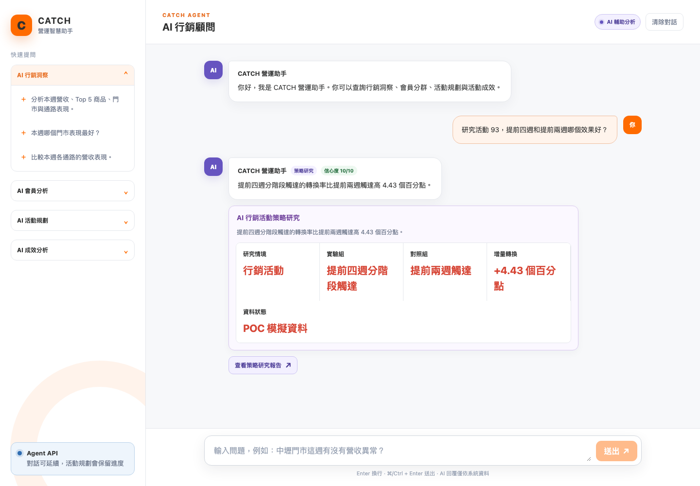
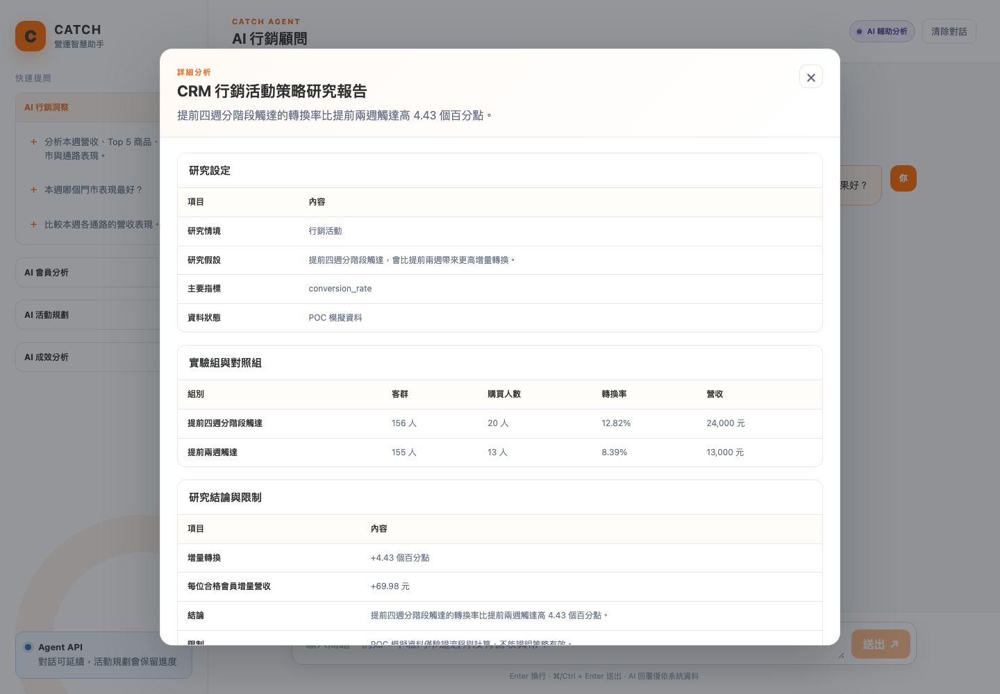

# AI 行銷顧問 Agent｜行銷情境 E2E 測試報告

- 測試時間：2026-08-24T12:38:48
- 測試入口：`http://127.0.0.1:5176`
- CRM Demo 模式：Agent 透過 HTTP CRM Adapter 取得 CRM Backend 回覆
- 驗證內容：AI 行銷洞察、AI 會員分析、AI 行銷活動建議、AI 行銷成效分析、CRM 策略研究

## 結果

| 情境 | 結果 |
| --- | --- |
| AI 行銷洞察 | PASS |
| AI 會員分析 | PASS |
| AI 行銷活動建議 | PASS |
| AI 行銷成效分析 | PASS |
| CRM 行銷活動策略研究 | PASS |

## 逐情境對話紀錄

## AI 行銷洞察

### 步驟 1｜使用者輸入與 API 請求

- 對話輸入：`分析本週營收、Top 5 商品、門市與通路異常。`
- API：`POST /api/v1/agent/query`

```json
{
  "message": "分析本週營收、Top 5 商品、門市與通路異常。",
  "timezone": "Asia/Taipei",
  "context": {
    "store_codes": []
  }
}
```

### 步驟 2｜Agent API 回傳

- resolved tool：`analyze_marketing_insights`
- resolved task：`marketing_insights`
- 回覆文字：CRM 已提供營收、商品與通路資料；毛利與同期異常需由 CRM 報表資料補足。
- 信心度：`10/10`

```json
{
  "resolved_intent": {
    "task": "marketing_insights",
    "tool": {
      "tool": "analyze_marketing_insights"
    }
  },
  "reply": {
    "text": "CRM 已提供營收、商品與通路資料；毛利與同期異常需由 CRM 報表資料補足。",
    "confidence": 10,
    "cards": [
      {
        "type": "marketing_insight",
        "title": "AI 行銷洞察",
        "description": "全部門市｜分析期間：2026-08-24～2026-08-30",
        "items": [
          {
            "label": "Top 1 商品",
            "value": "資料不可用",
            "unit": null,
            "change_pct": null,
            "status": "unavailable"
          },
          {
            "label": "營收最高通路",
            "value": "資料不可用",
            "unit": null,
            "change_pct": null,
            "status": "unavailable"
          },
          {
            "label": "門市營收狀態",
            "value": "CRM 未提供異常判斷",
            "unit": null,
            "change_pct": null,
            "status": "normal"
          },
          {
            "label": "高營收低毛利",
            "value": "CRM 未提供毛利資料",
            "unit": null,
            "change_pct": null,
            "status": "unavailable"
          },
          {
            "label": "營收最高門市",
            "value": "資料不可用",
            "unit": null,
            "change_pct": null,
            "status": "unavailable"
          }
        ]
      },
      {
        "type": "anomaly_list",
        "title": "商品與通路異常",
        "description": null,
        "items": [
          {
            "label": "異常項目",
            "value": "目前沒有可辨識異常",
            "unit": null,
            "change_pct": null,
            "status": "normal"
          }
        ]
      }
    ],
    "actions": [
      {
        "type": "open_report",
        "label": "查看完整洞察報告",
        "payload": {
          "report_id": "crm-insight-2026-08-24-2026-08-30-all"
        }
      },
      {
        "type": "continue_chat",
        "label": "規劃改善活動",
        "payload": {
          "message": "根據剛才的洞察規劃一個改善活動"
        }
      }
    ],
    "reports": [
      {
        "report_id": "crm-insight-2026-08-24-2026-08-30-all",
        "title": "AI 行銷洞察詳細報告",
        "summary": "CRM 已提供營收、商品與通路資料；毛利與同期異常需由 CRM 報表資料補足。",
        "section_titles": [
          "Top 商品",
          "通路比較",
          "門市營收",
          "改善建議"
        ]
      }
    ]
  }
}
```

### 步驟 3｜觸發字卡

#### `marketing_insight`｜AI 行銷洞察

全部門市｜分析期間：2026-08-24～2026-08-30

| 欄位 | 回傳值 | 狀態 |
| --- | --- | --- |
| Top 1 商品 | 資料不可用 | unavailable |
| 營收最高通路 | 資料不可用 | unavailable |
| 門市營收狀態 | CRM 未提供異常判斷 | normal |
| 高營收低毛利 | CRM 未提供毛利資料 | unavailable |
| 營收最高門市 | 資料不可用 | unavailable |

#### `anomaly_list`｜商品與通路異常

無額外說明

| 欄位 | 回傳值 | 狀態 |
| --- | --- | --- |
| 異常項目 | 目前沒有可辨識異常 | normal |

### 步驟 4｜可操作按鈕

| 按鈕文字 | action type | payload |
| --- | --- | --- |
| 查看完整洞察報告 | `open_report` | `{"report_id": "crm-insight-2026-08-24-2026-08-30-all"}` |
| 規劃改善活動 | `continue_chat` | `{"message": "根據剛才的洞察規劃一個改善活動"}` |

### 步驟 5｜按鈕後續畫面

- 點擊按鈕：`查看完整洞察報告`
- 報告標題：AI 行銷洞察詳細報告
- 報告摘要：CRM 已提供營收、商品與通路資料；毛利與同期異常需由 CRM 報表資料補足。

| 報告區塊 | 欄位 | 資料筆數 | 前 5 筆資料 |
| --- | --- | ---: | --- |
| Top 商品 | 商品、營收、銷量、變化 | 0 | 無資料 |
| 通路比較 | 通路、營收、訂單、變化 | 0 | 無資料 |
| 門市營收 | 門市、營收、變化 | 0 | 無資料 |
| 改善建議 | 建議 | 2 | 檢視商品毛利資料；對下滑通路安排活動測試 |

- 對應截圖：`advisor_screenshots/01_insights_card.png`
- 後續畫面截圖：`advisor_screenshots/01_insights_report.png`

## AI 會員分析

### 步驟 1｜使用者輸入與 API 請求

- 對話輸入：`找出最近最可能購買、即將流失及值得優先經營的會員。`
- API：`POST /api/v1/agent/query`

```json
{
  "message": "找出最近最可能購買、即將流失及值得優先經營的會員。",
  "timezone": "Asia/Taipei",
  "context": {
    "store_codes": []
  }
}
```

### 步驟 2｜Agent API 回傳

- resolved tool：`analyze_member_segments`
- resolved task：`member_analysis`
- 回覆文字：CRM RFM 資料已完成會員分群篩選。
- 信心度：`10/10`

```json
{
  "resolved_intent": {
    "task": "member_analysis",
    "tool": {
      "tool": "analyze_member_segments"
    }
  },
  "reply": {
    "text": "CRM RFM 資料已完成會員分群篩選。",
    "confidence": 10,
    "cards": [
      {
        "type": "member_analysis",
        "title": "AI 會員分析",
        "description": "已從 CRM RFM 資料找出 high_intent 對象。",
        "items": [
          {
            "label": "分析類型",
            "value": "高購買意願",
            "unit": null,
            "change_pct": null,
            "status": "info"
          },
          {
            "label": "符合會員",
            "value": "240 人",
            "unit": null,
            "change_pct": null,
            "status": "normal"
          },
          {
            "label": "優先對象",
            "value": "會員 #265",
            "unit": null,
            "change_pct": null,
            "status": "info"
          },
          {
            "label": "主要分群",
            "value": "重要價值客",
            "unit": null,
            "change_pct": null,
            "status": "info"
          }
        ]
      }
    ],
    "actions": [
      {
        "type": "open_report",
        "label": "查看會員分析報告",
        "payload": {
          "report_id": "crm-member-high_intent"
        }
      },
      {
        "type": "continue_chat",
        "label": "建立會員活動",
        "payload": {
          "message": "根據這份會員名單建立行銷活動"
        }
      }
    ],
    "reports": [
      {
        "report_id": "crm-member-high_intent",
        "title": "AI 會員分析詳細報告",
        "summary": "CRM RFM 資料已完成會員分群篩選。",
        "section_titles": [
          "優先會員名單（已隱藏個資）",
          "經營建議"
        ]
      }
    ]
  }
}
```

### 步驟 3｜觸發字卡

#### `member_analysis`｜AI 會員分析

已從 CRM RFM 資料找出 high_intent 對象。

| 欄位 | 回傳值 | 狀態 |
| --- | --- | --- |
| 分析類型 | 高購買意願 | info |
| 符合會員 | 240 人 | normal |
| 優先對象 | 會員 #265 | info |
| 主要分群 | 重要價值客 | info |

### 步驟 4｜可操作按鈕

| 按鈕文字 | action type | payload |
| --- | --- | --- |
| 查看會員分析報告 | `open_report` | `{"report_id": "crm-member-high_intent"}` |
| 建立會員活動 | `continue_chat` | `{"message": "根據這份會員名單建立行銷活動"}` |

### 步驟 5｜按鈕後續畫面

- 點擊按鈕：`查看會員分析報告`
- 報告標題：AI 會員分析詳細報告
- 報告摘要：CRM RFM 資料已完成會員分群篩選。

| 報告區塊 | 欄位 | 資料筆數 | 前 5 筆資料 |
| --- | --- | ---: | --- |
| 優先會員名單（已隱藏個資） | 會員識別碼、分群、最近消費、消費頻率、累積消費、購買機率 | 20 | 會員 #265／重要價值客／19 天前／29 次／160,820 元／87%；會員 #267／重要價值客／6 天前／30 次／159,420 元／96%；會員 #262／重要價值客／3 天前／29 次／151,920 元／98%；會員 #254／重要價值客／3 天前／30 次／143,400 元／98%；會員 #245／重要價值客／15 天前／30 次／143,120 元／90% |
| 經營建議 | 建議 | 2 | 依分群建立優惠活動；持續追蹤分群變化 |

- 對應截圖：`advisor_screenshots/02_members_card.png`
- 後續畫面截圖：`advisor_screenshots/02_members_report.png`

## AI 行銷活動建議

### 步驟 1｜使用者輸入與 API 請求

- 對話輸入：`規劃沉睡會員的蛋糕喚回活動，提供 9 折優惠。`
- API：`POST /api/v1/agent/query`

```json
{
  "message": "規劃沉睡會員的蛋糕喚回活動，提供 9 折優惠。",
  "timezone": "Asia/Taipei",
  "context": {
    "store_codes": []
  }
}
```

### 步驟 2｜Agent API 回傳

- resolved tool：`create_marketing_campaign`
- resolved task：`marketing_campaign_plan`
- 回覆文字：已依你的需求完成「沉睡會員蛋糕專屬優惠」活動規劃。
規劃發想：依沉睡會員條件鎖定高潛力會員，透過會員專屬溝通提高回購與客單價。
決策重點：客群鎖定一般挽留客；主推蛋糕；提供0.9 折；以門市為主要通路；活動期間30天。
目前預估 155 位會員符合條件，請確認後建立 CRM 活動草稿。
- 信心度：`10/10`

```json
{
  "resolved_intent": {
    "task": "marketing_campaign_plan",
    "tool": {
      "tool": "create_marketing_campaign"
    }
  },
  "reply": {
    "text": "已依你的需求完成「沉睡會員蛋糕專屬優惠」活動規劃。\n規劃發想：依沉睡會員條件鎖定高潛力會員，透過會員專屬溝通提高回購與客單價。\n決策重點：客群鎖定一般挽留客；主推蛋糕；提供0.9 折；以門市為主要通路；活動期間30天。\n目前預估 155 位會員符合條件，請確認後建立 CRM 活動草稿。",
    "confidence": 10,
    "cards": [
      {
        "type": "marketing_plan",
        "title": "AI 行銷活動規劃",
        "description": "已完成 CRM 客群預覽，請確認後建立活動草稿。",
        "items": [
          {
            "label": "活動主題",
            "value": "沉睡會員蛋糕專屬優惠",
            "unit": null,
            "change_pct": null,
            "status": "info"
          },
          {
            "label": "目標客群",
            "value": "一般挽留客",
            "unit": null,
            "change_pct": null,
            "status": "info"
          },
          {
            "label": "預估客群",
            "value": "155 人",
            "unit": null,
            "change_pct": null,
            "status": "normal"
          },
          {
            "label": "優惠內容",
            "value": "0.9 折",
            "unit": null,
            "change_pct": null,
            "status": "info"
          },
          {
            "label": "建議通路",
            "value": "門市",
            "unit": null,
            "change_pct": null,
            "status": "info"
          },
          {
            "label": "活動期間",
            "value": "30 天",
            "unit": null,
            "change_pct": null,
            "status": "info"
          },
          {
            "label": "CRM 草稿",
            "value": "尚未建立",
            "unit": null,
            "change_pct": null,
            "status": "info"
          },
          {
            "label": "活動說明",
            "value": "以沉睡會員的專屬回饋提升會員回購與客單價。",
            "unit": null,
            "change_pct": null,
            "status": "info"
          },
          {
            "label": "規劃發想",
            "value": "依沉睡會員條件鎖定高潛力會員，透過會員專屬溝通提高回購與客單價。",
            "unit": null,
            "change_pct": null,
            "status": "info"
          },
          {
            "label": "決策重點",
            "value": "客群鎖定一般挽留客；主推蛋糕；提供0.9 折；以門市為主要通路；活動期間30天。",
            "unit": null,
            "change_pct": null,
            "status": "info"
          },
          {
            "label": "主推商品",
            "value": "蛋糕",
            "unit": null,
            "change_pct": null,
            "status": "info"
          }
        ]
      }
    ],
    "actions": [
      {
        "type": "create_campaign_draft",
        "label": "建立活動草稿",
        "payload": {}
      },
      {
        "type": "continue_chat",
        "label": "調整活動條件",
        "payload": {
          "message": "請調整這個活動規劃"
        }
      }
    ],
    "reports": []
  }
}
```

### 步驟 3｜觸發字卡

#### `marketing_plan`｜AI 行銷活動規劃

已完成 CRM 客群預覽，請確認後建立活動草稿。

| 欄位 | 回傳值 | 狀態 |
| --- | --- | --- |
| 活動主題 | 沉睡會員蛋糕專屬優惠 | info |
| 目標客群 | 一般挽留客 | info |
| 預估客群 | 155 人 | normal |
| 優惠內容 | 0.9 折 | info |
| 建議通路 | 門市 | info |
| 活動期間 | 30 天 | info |
| CRM 草稿 | 尚未建立 | info |
| 活動說明 | 以沉睡會員的專屬回饋提升會員回購與客單價。 | info |
| 規劃發想 | 依沉睡會員條件鎖定高潛力會員，透過會員專屬溝通提高回購與客單價。 | info |
| 決策重點 | 客群鎖定一般挽留客；主推蛋糕；提供0.9 折；以門市為主要通路；活動期間30天。 | info |
| 主推商品 | 蛋糕 | info |

### 步驟 4｜可操作按鈕

| 按鈕文字 | action type | payload |
| --- | --- | --- |
| 建立活動草稿 | `create_campaign_draft` | `{}` |
| 調整活動條件 | `continue_chat` | `{"message": "請調整這個活動規劃"}` |

### 步驟 5｜按鈕後續畫面

| 流程步驟 | API | 回傳摘要 |
| --- | --- | --- |
| 建立活動草稿（使用者確認後） | `POST /api/v1/agent/campaigns/draft` | 已依你的需求完成「沉睡會員蛋糕專屬優惠」活動規劃。
規劃發想：依沉睡會員條件鎖定高潛力會員，透過會員專屬溝通提高回購與客單價。
決策重點：客群鎖定一般挽留客；主推蛋糕；提供0.9 折；以門市為主要通路；活動期間30天。
目前預估 457 位會員符合條件，CRM 草稿編號為 93，請確認是否發送優惠券。 |
| 發送優惠券（Demo 確認後） | `POST /api/v1/agent/campaigns/{campaign_id}/send` | 已完成 CRM 優惠券發送，活動 93 共建立 311 張優惠券。 |

- 對應截圖：`advisor_screenshots/03_campaign_plan_card.png`
- 後續畫面截圖：`advisor_screenshots/03_campaign_plan_sent.png`

## AI 行銷成效分析

### 步驟 1｜使用者輸入與 API 請求

- 對話輸入：`分析活動 93 是否成功，以及下一次怎麼改善。`
- API：`POST /api/v1/agent/query`

```json
{
  "message": "分析活動 93 是否成功，以及下一次怎麼改善。",
  "timezone": "Asia/Taipei",
  "context": {
    "store_codes": []
  }
}
```

### 步驟 2｜Agent API 回傳

- resolved tool：`analyze_campaign_performance`
- resolved task：`campaign_performance`
- 回覆文字：活動已執行，已發券 311 張、核銷 0 張，目前核銷率 0.00%。
- 信心度：`10/10`

```json
{
  "resolved_intent": {
    "task": "campaign_performance",
    "tool": {
      "tool": "analyze_campaign_performance"
    }
  },
  "reply": {
    "text": "活動已執行，已發券 311 張、核銷 0 張，目前核銷率 0.00%。",
    "confidence": 10,
    "cards": [
      {
        "type": "campaign_performance",
        "title": "AI 行銷成效分析",
        "description": "活動 93：活動已執行，已發券 311 張、核銷 0 張，目前核銷率 0.00%。",
        "items": [
          {
            "label": "活動狀態",
            "value": "executed",
            "unit": null,
            "change_pct": null,
            "status": "info"
          },
          {
            "label": "核銷率",
            "value": "0.0%",
            "unit": null,
            "change_pct": null,
            "status": "anomaly"
          },
          {
            "label": "活動營收",
            "value": "0 元",
            "unit": "營收",
            "change_pct": null,
            "status": "normal"
          },
          {
            "label": "30 天回購",
            "value": "0.0%",
            "unit": null,
            "change_pct": null,
            "status": "info"
          }
        ]
      }
    ],
    "actions": [
      {
        "type": "open_report",
        "label": "查看完整成效報告",
        "payload": {
          "report_id": "crm-campaign-performance-93"
        }
      }
    ],
    "reports": [
      {
        "report_id": "crm-campaign-performance-93",
        "title": "AI 行銷成效詳細報告",
        "summary": "活動已執行，已發券 311 張、核銷 0 張，目前核銷率 0.00%。",
        "section_titles": [
          "活動 KPI",
          "改善建議"
        ]
      }
    ]
  }
}
```

### 步驟 3｜觸發字卡

#### `campaign_performance`｜AI 行銷成效分析

活動 93：活動已執行，已發券 311 張、核銷 0 張，目前核銷率 0.00%。

| 欄位 | 回傳值 | 狀態 |
| --- | --- | --- |
| 活動狀態 | executed | info |
| 核銷率 | 0.0% | anomaly |
| 活動營收 | 0 元營收 | normal |
| 30 天回購 | 0.0% | info |

### 步驟 4｜可操作按鈕

| 按鈕文字 | action type | payload |
| --- | --- | --- |
| 查看完整成效報告 | `open_report` | `{"report_id": "crm-campaign-performance-93"}` |

### 步驟 5｜按鈕後續畫面

- 點擊按鈕：`查看完整成效報告`
- 報告標題：AI 行銷成效詳細報告
- 報告摘要：活動已執行，已發券 311 張、核銷 0 張，目前核銷率 0.00%。

| 報告區塊 | 欄位 | 資料筆數 | 前 5 筆資料 |
| --- | --- | ---: | --- |
| 活動 KPI | 指標、數值 | 8 | 活動狀態／executed；目標客群／311 人；已發送／311 人；已使用／0 人；核銷率／0.0% |
| 改善建議 | 建議 | 2 | 補充活動訂單歸因；於活動結束後 7／30 天追蹤回購 |

- 對應截圖：`advisor_screenshots/04_campaign_performance_card.png`
- 後續畫面截圖：`advisor_screenshots/04_campaign_performance_report.png`

## CRM 行銷活動策略研究

### 步驟 1｜使用者輸入與 API 請求

- 對話輸入：`研究活動 93，提前四週和提前兩週哪個效果好？`
- API：`POST /api/v1/agent/query`

```json
{
  "message": "研究活動 93，提前四週和提前兩週哪個效果好？",
  "timezone": "Asia/Taipei",
  "context": {
    "store_codes": []
  }
}
```

### 步驟 2｜Agent API 回傳

- resolved tool：`analyze_strategy_study`
- resolved task：`strategy_research`
- 回覆文字：提前四週分階段觸達的轉換率比提前兩週觸達高 4.43 個百分點。
- 信心度：`10/10`

```json
{
  "resolved_intent": {
    "task": "strategy_research",
    "tool": {
      "tool": "analyze_strategy_study"
    }
  },
  "reply": {
    "text": "提前四週分階段觸達的轉換率比提前兩週觸達高 4.43 個百分點。",
    "confidence": 10,
    "cards": [
      {
        "type": "strategy_research",
        "title": "AI 行銷活動策略研究",
        "description": "提前四週分階段觸達的轉換率比提前兩週觸達高 4.43 個百分點。",
        "items": [
          {
            "label": "研究情境",
            "value": "行銷活動",
            "unit": null,
            "change_pct": null,
            "status": "info"
          },
          {
            "label": "實驗組",
            "value": "提前四週分階段觸達",
            "unit": null,
            "change_pct": null,
            "status": "info"
          },
          {
            "label": "對照組",
            "value": "提前兩週觸達",
            "unit": null,
            "change_pct": null,
            "status": "info"
          },
          {
            "label": "增量轉換",
            "value": "+4.43 個百分點",
            "unit": null,
            "change_pct": null,
            "status": "normal"
          },
          {
            "label": "資料狀態",
            "value": "POC 模擬資料",
            "unit": null,
            "change_pct": null,
            "status": "info"
          }
        ]
      }
    ],
    "actions": [
      {
        "type": "open_report",
        "label": "查看策略研究報告",
        "payload": {
          "report_id": "crm-strategy-study-4"
        }
      }
    ],
    "reports": [
      {
        "report_id": "crm-strategy-study-4",
        "title": "CRM 行銷活動策略研究報告",
        "summary": "提前四週分階段觸達的轉換率比提前兩週觸達高 4.43 個百分點。",
        "section_titles": [
          "研究設定",
          "實驗組與對照組",
          "研究結論與限制"
        ]
      }
    ]
  }
}
```

### 步驟 3｜觸發字卡

#### `strategy_research`｜AI 行銷活動策略研究

提前四週分階段觸達的轉換率比提前兩週觸達高 4.43 個百分點。

| 欄位 | 回傳值 | 狀態 |
| --- | --- | --- |
| 研究情境 | 行銷活動 | info |
| 實驗組 | 提前四週分階段觸達 | info |
| 對照組 | 提前兩週觸達 | info |
| 增量轉換 | +4.43 個百分點 | normal |
| 資料狀態 | POC 模擬資料 | info |

### 步驟 4｜可操作按鈕

| 按鈕文字 | action type | payload |
| --- | --- | --- |
| 查看策略研究報告 | `open_report` | `{"report_id": "crm-strategy-study-4"}` |

### 步驟 5｜按鈕後續畫面

- 點擊按鈕：`查看策略研究報告`
- 報告標題：CRM 行銷活動策略研究報告
- 報告摘要：提前四週分階段觸達的轉換率比提前兩週觸達高 4.43 個百分點。

| 報告區塊 | 欄位 | 資料筆數 | 前 5 筆資料 |
| --- | --- | ---: | --- |
| 研究設定 | 項目、內容 | 4 | 研究情境／行銷活動；研究假設／提前四週分階段觸達，會比提前兩週帶來更高增量轉換。；主要指標／conversion_rate；資料狀態／POC 模擬資料 |
| 實驗組與對照組 | 組別、客群、購買人數、轉換率、營收 | 2 | 提前四週分階段觸達／156 人／20 人／12.82%／24,000 元；提前兩週觸達／155 人／13 人／8.39%／13,000 元 |
| 研究結論與限制 | 項目、內容 | 6 | 增量轉換／+4.43 個百分點；每位合格會員增量營收／+69.98 元；結論／提前四週分階段觸達的轉換率比提前兩週觸達高 4.43 個百分點。；限制／POC 模擬資料僅驗證流程與計算，不能證明策略有效。；下一步／接入真實發送、領券、核銷與訂單事件後再判定策略優劣。 |

- 對應截圖：`advisor_screenshots/05_strategy_research_card.png`
- 後續畫面截圖：`advisor_screenshots/05_strategy_research_report.png`

## 流程截圖總覽





## 驗收

- 五種情境均由對話輸入觸發 Agent API。
- cards 顯示 CRM facts 摘要。
- 洞察、會員與成效情境可開啟詳細報告。
- 活動建議情境可開啟 CRM 活動草稿詳情。
- Browser page errors：0
- Console errors：0
