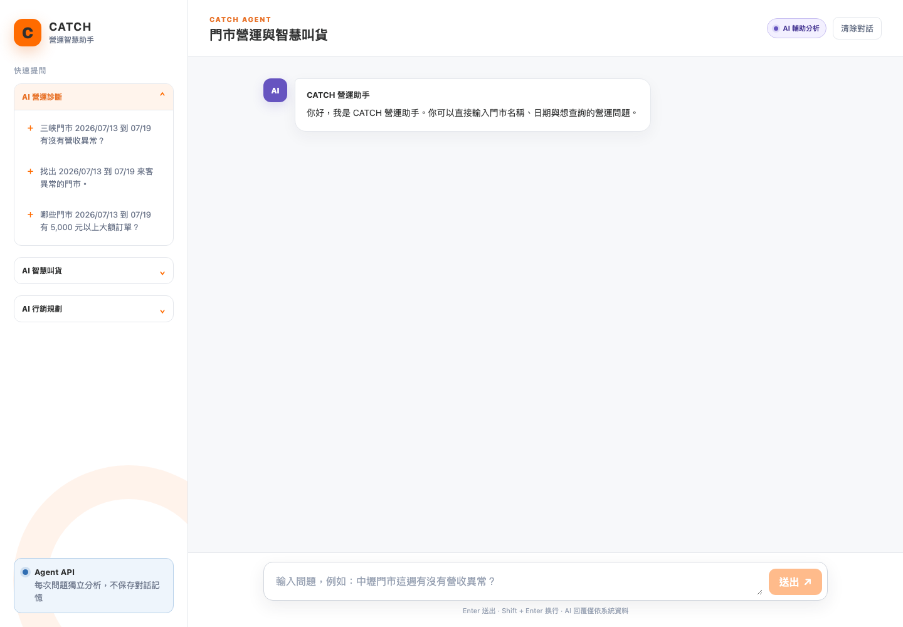
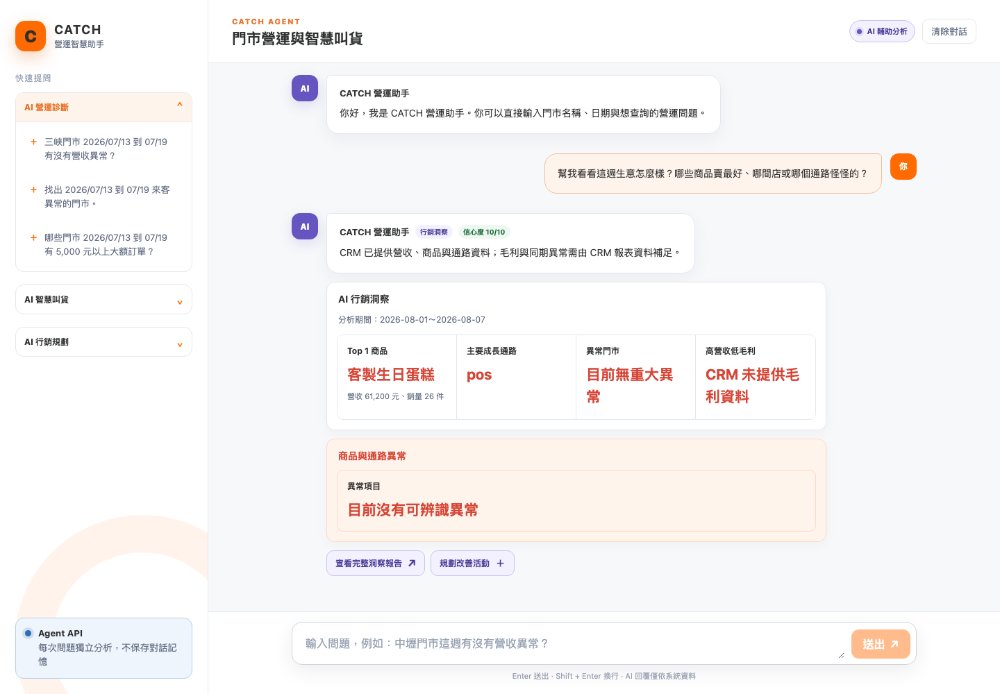
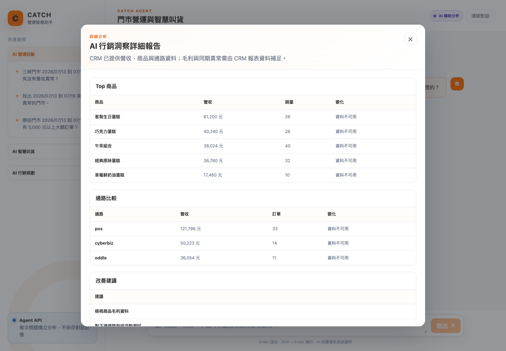
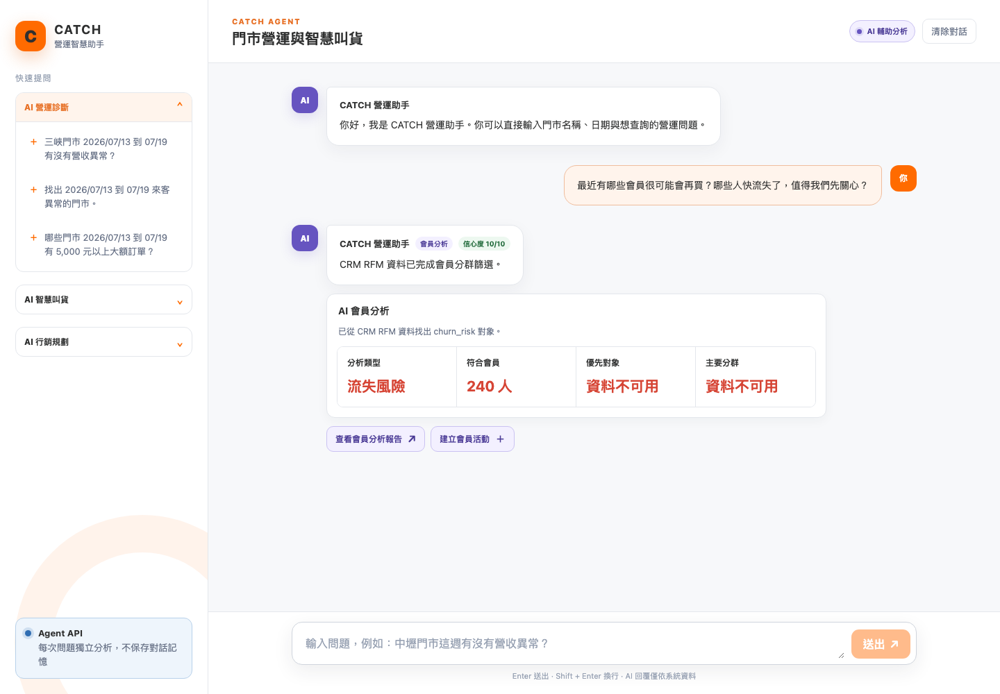
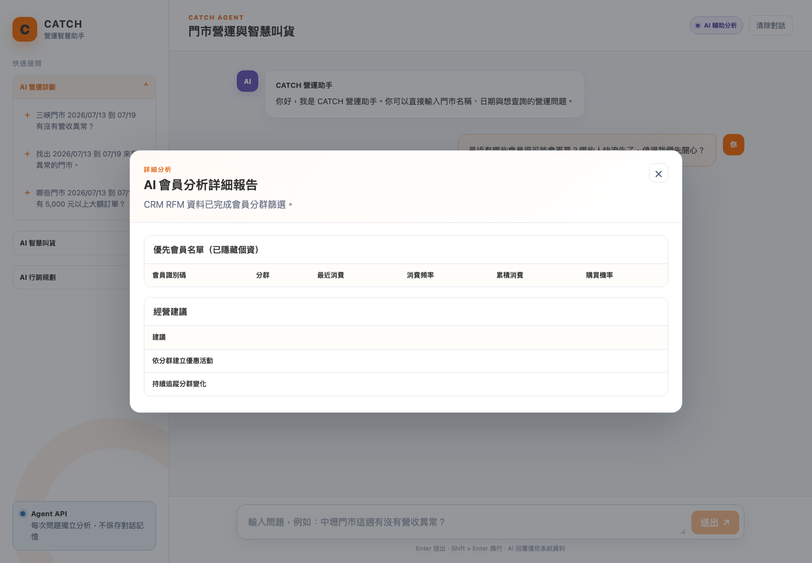
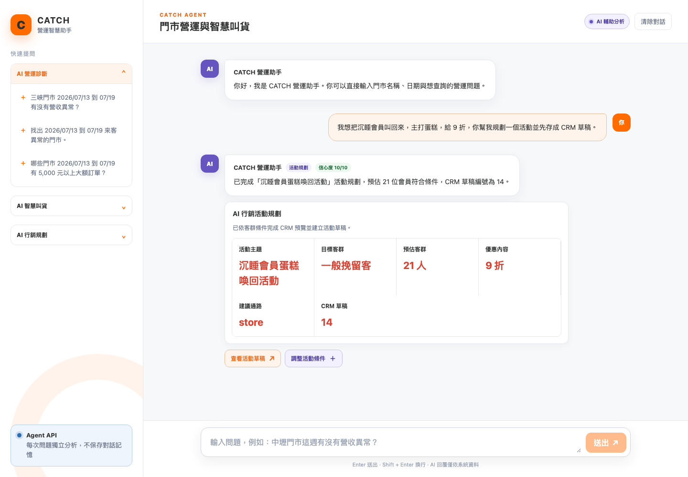
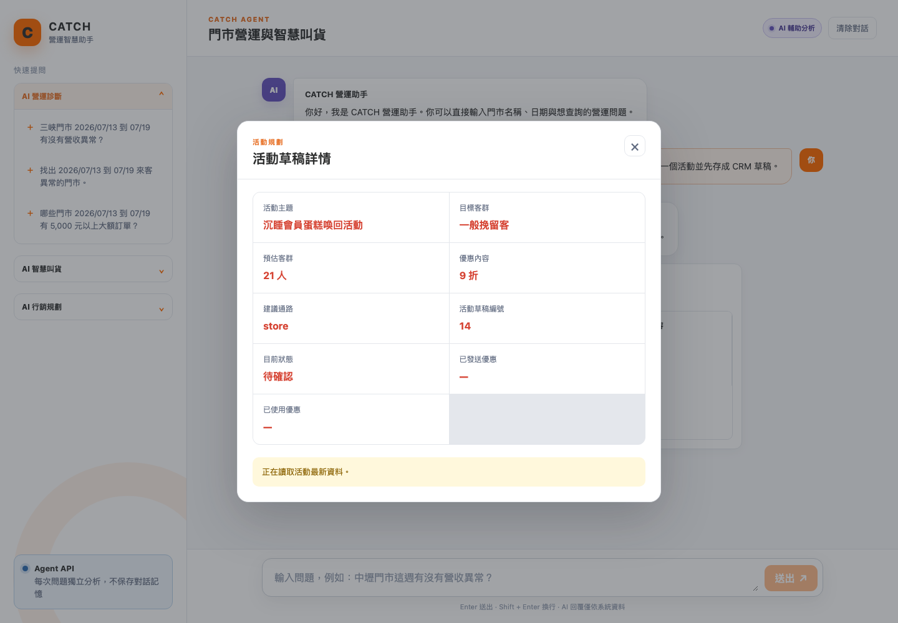
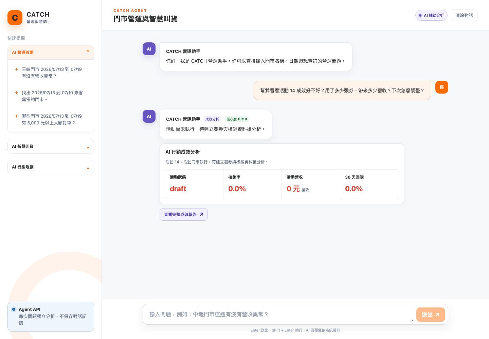
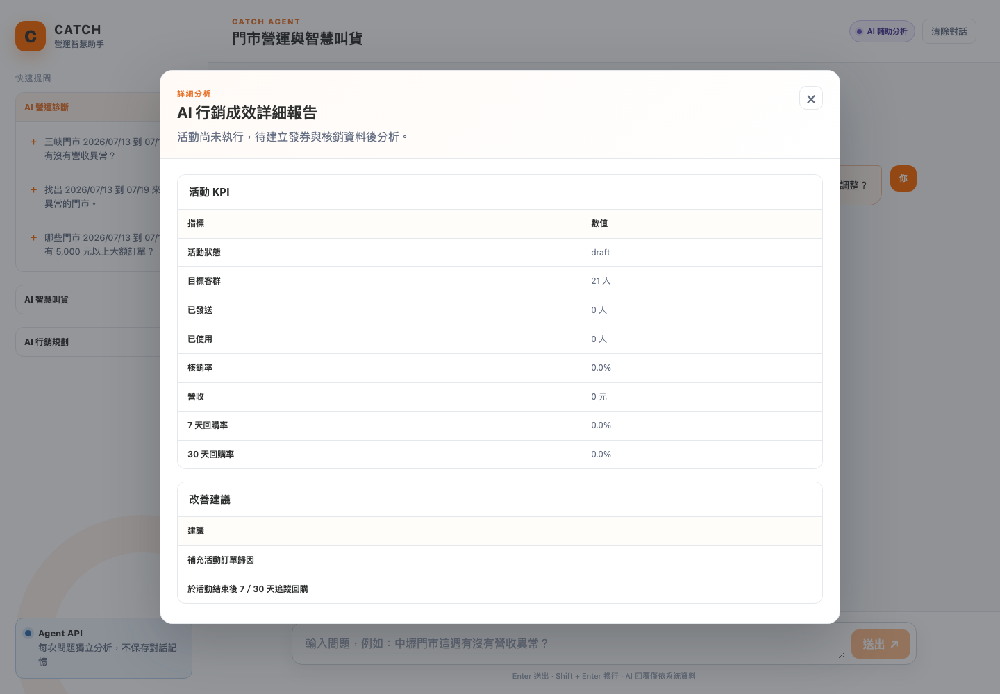

# AI 行銷顧問｜真實 CRM E2E 測試報告

- 測試時間：2026-08-12T16:16:54
- 測試入口：`http://127.0.0.1:5176`
- CRM Adapter：HTTP 真實 CRM API
- LLM：本次使用 deterministic Demo LLM，僅驗證真實 CRM HTTP 串接，不產生外部 LLM 費用

## 結果

| 情境 | 結果 |
| --- | --- |
| AI 行銷洞察 | PASS |
| AI 會員分析 | PASS |
| AI 行銷活動建議 | PASS |
| AI 行銷成效分析 | PASS |

## 對話與 API 摘要

### AI 行銷洞察

- 輸入：幫我看看這週生意怎麼樣？哪些商品賣最好、哪間店或哪個通路怪怪的？
- CRM 活動：不適用
- Agent 回傳：
```json
{
  "resolved_intent": {
    "task": "marketing_insights",
    "tool": {
      "tool": "analyze_marketing_insights"
    }
  },
  "reply": {
    "text": "CRM 已提供營收、商品與通路資料；毛利與同期異常需由 CRM 報表資料補足。",
    "confidence": 10,
    "cards": [
      "marketing_insight",
      "anomaly_list"
    ],
    "actions": [
      {
        "type": "open_report",
        "label": "查看完整洞察報告",
        "payload": {
          "report_id": "crm-insight-2026-08-01-2026-08-07"
        }
      },
      {
        "type": "continue_chat",
        "label": "規劃改善活動",
        "payload": {
          "message": "根據剛才的洞察規劃一個改善活動"
        }
      }
    ],
    "report_ids": [
      "crm-insight-2026-08-01-2026-08-07"
    ]
  }
}
```

### AI 會員分析

- 輸入：最近有哪些會員很可能會再買？哪些人快流失了，值得我們先關心？
- CRM 活動：不適用
- Agent 回傳：
```json
{
  "resolved_intent": {
    "task": "member_analysis",
    "tool": {
      "tool": "analyze_member_segments"
    }
  },
  "reply": {
    "text": "CRM RFM 資料已完成會員分群篩選。",
    "confidence": 10,
    "cards": [
      "member_analysis"
    ],
    "actions": [
      {
        "type": "open_report",
        "label": "查看會員分析報告",
        "payload": {
          "report_id": "crm-member-churn_risk"
        }
      },
      {
        "type": "continue_chat",
        "label": "建立會員活動",
        "payload": {
          "message": "根據這份會員名單建立行銷活動"
        }
      }
    ],
    "report_ids": [
      "crm-member-churn_risk"
    ]
  }
}
```

### AI 行銷活動建議

- 輸入：我想把沉睡會員叫回來，主打蛋糕，給 9 折，你幫我規劃一個活動並先存成 CRM 草稿。
- CRM 活動：14
- Agent 回傳：
```json
{
  "resolved_intent": {
    "task": "marketing_campaign_plan",
    "tool": {
      "tool": "create_marketing_campaign"
    }
  },
  "reply": {
    "text": "已完成「沉睡會員蛋糕喚回活動」活動規劃，預估 21 位會員符合條件，CRM 草稿編號為 14。",
    "confidence": 10,
    "cards": [
      "marketing_plan"
    ],
    "actions": [
      {
        "type": "open_campaign",
        "label": "查看活動草稿",
        "payload": {
          "campaign_id": "14"
        }
      },
      {
        "type": "continue_chat",
        "label": "調整活動條件",
        "payload": {
          "message": "請調整這個活動規劃"
        }
      }
    ],
    "report_ids": []
  }
}
```

### AI 行銷成效分析

- 輸入：幫我看看活動 14 成效好不好？用了多少張券、帶來多少營收？下次怎麼調整？
- CRM 活動：14
- Agent 回傳：
```json
{
  "resolved_intent": {
    "task": "campaign_performance",
    "tool": {
      "tool": "analyze_campaign_performance"
    }
  },
  "reply": {
    "text": "活動尚未執行，待建立發券與核銷資料後分析。",
    "confidence": 10,
    "cards": [
      "campaign_performance"
    ],
    "actions": [
      {
        "type": "open_report",
        "label": "查看完整成效報告",
        "payload": {
          "report_id": "crm-campaign-performance-14"
        }
      }
    ],
    "report_ids": [
      "crm-campaign-performance-14"
    ]
  }
}
```

## 截圖











- Browser page errors：0
- Console errors：0
