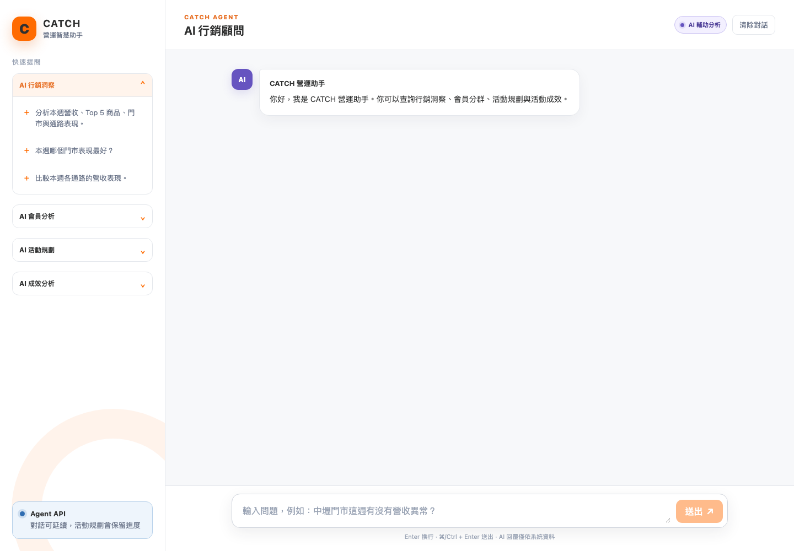
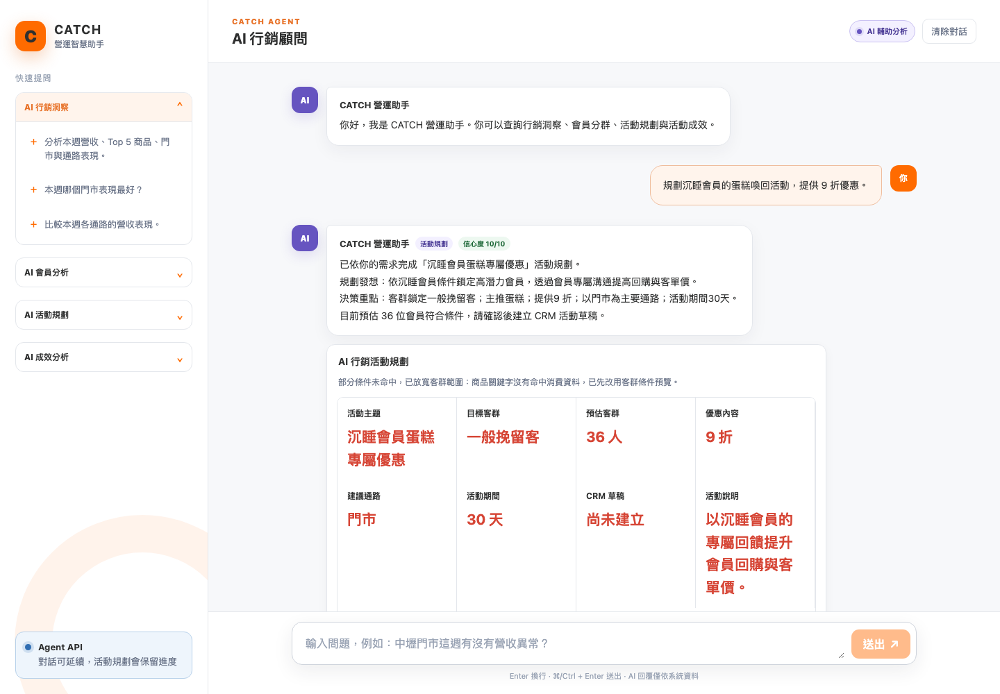
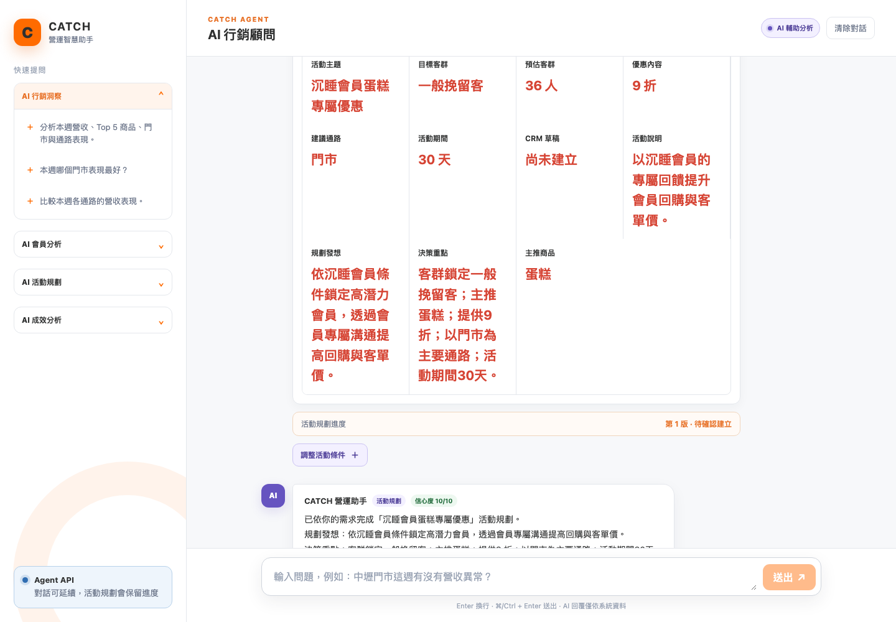
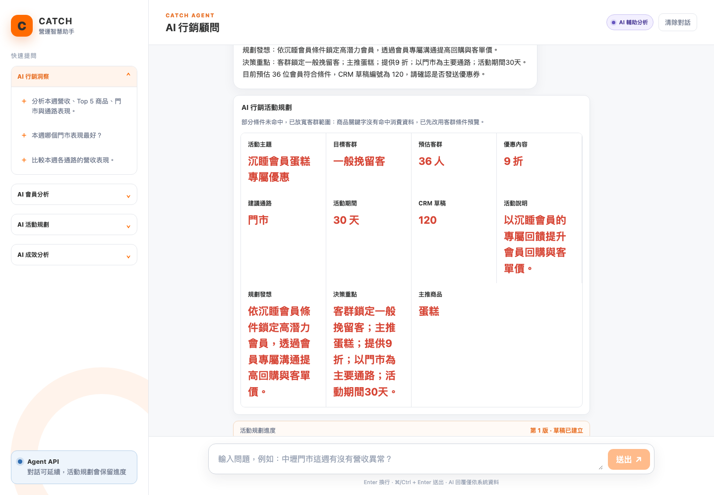
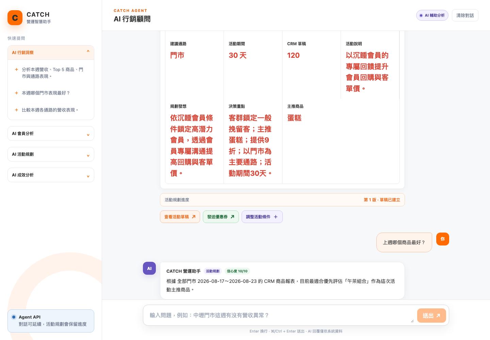
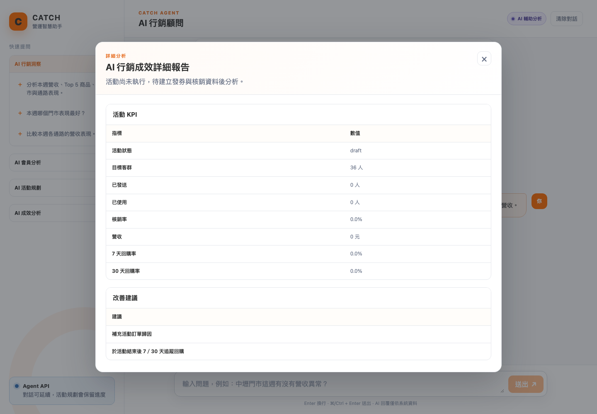

# AI 行銷活動建議｜基礎閉環 E2E 測試報告

- 測試時間：2026-08-25T11:30:17
- 測試結果：**PASS**
- 測試範圍：活動規劃 → CRM 客群預覽 → 使用者確認建立草稿 → metrics 回查 → 上下文商品推薦 → 活動成效追問 → 對話保存
- 發送策略：本次不觸發優惠券發送，避免測試造成發送副作用

## 測試環境

```json
{
  "agent_frontend": "http://127.0.0.1:5176",
  "agent_backend": "http://127.0.0.1:8002",
  "crm_backend": "http://127.0.0.1:8012",
  "crm_database": "aposo_crm_agent_dev（dev 測試資料）",
  "llm_mode": "demo（本次未呼叫外部 LLM）",
  "crm_adapter_mode": "http"
}
```

## 注意事項

```json
[
  "目前未發現資料一致性警告。"
]
```

## 流程摘要

| 步驟 | 驗證內容 | 結果 |
| --- | --- | --- |
| 0. 服務健康檢查 | 輸入／輸出／UI Action 已記錄 | PASS |
| 1. AI 活動規劃與 CRM 客群預覽 | 輸入／輸出／UI Action 已記錄 | PASS |
| 2. 使用者確認建立 CRM 活動草稿 | 輸入／輸出／UI Action 已記錄 | PASS |
| 3. CRM 活動草稿狀態與 metrics 回查 | 輸入／輸出／UI Action 已記錄 | PASS |
| 4. 於同一活動上下文詢問主推商品 | 輸入／輸出／UI Action 已記錄 | PASS |
| 5. 同一對話追問活動成效 | 輸入／輸出／UI Action 已記錄 | PASS |
| 6. 對話與 workflow 狀態保存 | 輸入／輸出／UI Action 已記錄 | PASS |

## 逐步輸入與輸出

### 0. 服務健康檢查

#### 輸入

```json
{
  "services": [
    {
      "name": "agent_backend",
      "url": "http://127.0.0.1:8002/health",
      "status_code": 200,
      "body": {
        "status": "ok",
        "version": "0.1.0"
      }
    },
    {
      "name": "crm_backend",
      "url": "http://127.0.0.1:8012/health",
      "status_code": 200,
      "body": {
        "status": "ok",
        "version": "1.0.1"
      }
    }
  ]
}
```

#### 輸出

```json
{
  "result": "PASS",
  "isolated_ports": [
    8012,
    8002,
    5175,
    5176
  ]
}
```

### 1. AI 活動規劃與 CRM 客群預覽

#### 輸入

```json
{
  "user_message": "規劃沉睡會員的蛋糕喚回活動，提供 9 折優惠。",
  "request": {
    "message": "規劃沉睡會員的蛋糕喚回活動，提供 9 折優惠。",
    "timezone": "Asia/Taipei",
    "context": {
      "store_codes": []
    }
  }
}
```

#### 輸出

```json
{
  "status": null,
  "conversation_id": "conv_0142c7b28a66456f853d0adbada27669",
  "workflow": {
    "type": "marketing_campaign",
    "context_status": "active",
    "status": "plan_ready",
    "current_step": "create_draft",
    "source_text": "規劃沉睡會員的蛋糕喚回活動，提供 9 折優惠。",
    "revision": 1,
    "next_actions": [
      "create_campaign_draft",
      "continue_chat"
    ],
    "plan": {
      "campaign_name": "沉睡會員蛋糕專屬優惠",
      "objective": "以沉睡會員的專屬回饋提升會員回購與客單價。",
      "product_focus": "蛋糕",
      "coupon": {
        "name": "沉睡會員專屬9折",
        "channel": "store",
        "allowed_channels": [
          "store"
        ],
        "valid_days": 30,
        "point_cost": 1,
        "usage_scope": "all",
        "cyberbiz_coupon_type": "percent",
        "cyberbiz_coupon_value": 90,
        "cyberbiz_order_price_threshold": 0,
        "cyberbiz_tags": [],
        "member_visible": false,
        "points_redeemable": false,
        "redeem_kind": "coupon"
      },
      "audience_filters": {
        "product_keyword": "蛋糕",
        "rfm_segments": [
          "一般挽留客"
        ],
        "require_line_bound": false
      },
      "message_title": "沉睡會員專屬優惠",
      "message_content": "沉睡會員專屬回饋，憑券享蛋糕9折，限時使用。",
      "marketing_logic": "依沉睡會員條件鎖定高潛力會員，透過會員專屬溝通提高回購與客單價。"
    }
  },
  "resolved_intent": {
    "task": "marketing_campaign_plan",
    "tool": {
      "tool": "create_marketing_campaign"
    }
  },
  "reply": {
    "text": "已依你的需求完成「沉睡會員蛋糕專屬優惠」活動規劃。\n規劃發想：依沉睡會員條件鎖定高潛力會員，透過會員專屬溝通提高回購與客單價。\n決策重點：客群鎖定一般挽留客；主推蛋糕；提供9 折；以門市為主要通路；活動期間30天。\n目前預估 36 位會員符合條件，請確認後建立 CRM 活動草稿。",
    "confidence": 10,
    "cards": [
      {
        "type": "marketing_plan",
        "title": "AI 行銷活動規劃",
        "description": "部分條件未命中，已放寬客群範圍：商品關鍵字沒有命中消費資料，已先改用客群條件預覽。",
        "items": [
          {
            "label": "活動主題",
            "value": "沉睡會員蛋糕專屬優惠",
            "trend": "unavailable",
            "status": "info"
          },
          {
            "label": "目標客群",
            "value": "一般挽留客",
            "trend": "unavailable",
            "status": "info"
          },
          {
            "label": "預估客群",
            "value": "36 人",
            "trend": "unavailable",
            "status": "normal"
          },
          {
            "label": "優惠內容",
            "value": "9 折",
            "trend": "unavailable",
            "status": "info"
          },
          {
            "label": "建議通路",
            "value": "門市",
            "trend": "unavailable",
            "status": "info"
          },
          {
            "label": "活動期間",
            "value": "30 天",
            "trend": "unavailable",
            "status": "info"
          },
          {
            "label": "CRM 草稿",
            "value": "尚未建立",
            "trend": "unavailable",
            "status": "info"
          },
          {
            "label": "活動說明",
            "value": "以沉睡會員的專屬回饋提升會員回購與客單價。",
            "trend": "unavailable",
            "status": "info"
          },
          {
            "label": "規劃發想",
            "value": "依沉睡會員條件鎖定高潛力會員，透過會員專屬溝通提高回購與客單價。",
            "trend": "unavailable",
            "status": "info"
          },
          {
            "label": "決策重點",
            "value": "客群鎖定一般挽留客；主推蛋糕；提供9 折；以門市為主要通路；活動期間30天。",
            "trend": "unavailable",
            "status": "info"
          },
          {
            "label": "主推商品",
            "value": "蛋糕",
            "trend": "unavailable",
            "status": "info"
          }
        ]
      }
    ],
    "actions": [
      {
        "type": "create_campaign_draft",
        "label": "建立活動草稿",
        "payload": {}
      },
      {
        "type": "continue_chat",
        "label": "調整活動條件",
        "payload": {
          "message": "請調整這個活動規劃"
        }
      }
    ],
    "reports": []
  }
}
```

#### 字卡／按鈕／畫面驗收

```json
{
  "card_types": [
    "marketing_plan"
  ],
  "action_types": [
    "create_campaign_draft",
    "continue_chat"
  ],
  "workflow_display": "第 1 版 · 待確認建立"
}
```

### 2. 使用者確認建立 CRM 活動草稿

#### 輸入

```json
{
  "ui_action": "建立活動草稿",
  "confirm_dialog": "確認建立這份 CRM 活動草稿嗎？建立後仍需確認才會發送優惠券。",
  "request": {
    "conversation_id": "conv_0142c7b28a66456f853d0adbada27669"
  }
}
```

#### 輸出

```json
{
  "status": null,
  "conversation_id": "conv_0142c7b28a66456f853d0adbada27669",
  "workflow": {
    "type": "marketing_campaign",
    "context_status": "active",
    "status": "draft_created",
    "current_step": "send_coupon",
    "campaign_id": "120",
    "source_text": "規劃沉睡會員的蛋糕喚回活動，提供 9 折優惠。",
    "revision": 1,
    "next_actions": [
      "send_coupon",
      "open_campaign",
      "continue_chat"
    ],
    "plan": {
      "campaign_name": "沉睡會員蛋糕專屬優惠",
      "objective": "以沉睡會員的專屬回饋提升會員回購與客單價。",
      "product_focus": "蛋糕",
      "coupon": {
        "name": "沉睡會員專屬9折",
        "channel": "store",
        "allowed_channels": [
          "store"
        ],
        "valid_days": 30,
        "point_cost": 1,
        "usage_scope": "all",
        "cyberbiz_coupon_type": "percent",
        "cyberbiz_coupon_value": 90,
        "cyberbiz_order_price_threshold": 0,
        "cyberbiz_tags": [],
        "member_visible": false,
        "points_redeemable": false,
        "redeem_kind": "coupon"
      },
      "audience_filters": {
        "product_keyword": "蛋糕",
        "rfm_segments": [
          "一般挽留客"
        ],
        "require_line_bound": false
      },
      "message_title": "沉睡會員專屬優惠",
      "message_content": "沉睡會員專屬回饋，憑券享蛋糕9折，限時使用。",
      "marketing_logic": "依沉睡會員條件鎖定高潛力會員，透過會員專屬溝通提高回購與客單價。"
    }
  },
  "resolved_intent": {
    "task": "marketing_campaign_plan",
    "tool": {
      "tool": "create_marketing_campaign"
    }
  },
  "reply": {
    "text": "已依你的需求完成「沉睡會員蛋糕專屬優惠」活動規劃。\n規劃發想：依沉睡會員條件鎖定高潛力會員，透過會員專屬溝通提高回購與客單價。\n決策重點：客群鎖定一般挽留客；主推蛋糕；提供9 折；以門市為主要通路；活動期間30天。\n目前預估 36 位會員符合條件，CRM 草稿編號為 120，請確認是否發送優惠券。",
    "confidence": 10,
    "cards": [
      {
        "type": "marketing_plan",
        "title": "AI 行銷活動規劃",
        "description": "部分條件未命中，已放寬客群範圍：商品關鍵字沒有命中消費資料，已先改用客群條件預覽。",
        "items": [
          {
            "label": "活動主題",
            "value": "沉睡會員蛋糕專屬優惠",
            "trend": "unavailable",
            "status": "info"
          },
          {
            "label": "目標客群",
            "value": "一般挽留客",
            "trend": "unavailable",
            "status": "info"
          },
          {
            "label": "預估客群",
            "value": "36 人",
            "trend": "unavailable",
            "status": "normal"
          },
          {
            "label": "優惠內容",
            "value": "9 折",
            "trend": "unavailable",
            "status": "info"
          },
          {
            "label": "建議通路",
            "value": "門市",
            "trend": "unavailable",
            "status": "info"
          },
          {
            "label": "活動期間",
            "value": "30 天",
            "trend": "unavailable",
            "status": "info"
          },
          {
            "label": "CRM 草稿",
            "value": "120",
            "trend": "unavailable",
            "status": "normal"
          },
          {
            "label": "活動說明",
            "value": "以沉睡會員的專屬回饋提升會員回購與客單價。",
            "trend": "unavailable",
            "status": "info"
          },
          {
            "label": "規劃發想",
            "value": "依沉睡會員條件鎖定高潛力會員，透過會員專屬溝通提高回購與客單價。",
            "trend": "unavailable",
            "status": "info"
          },
          {
            "label": "決策重點",
            "value": "客群鎖定一般挽留客；主推蛋糕；提供9 折；以門市為主要通路；活動期間30天。",
            "trend": "unavailable",
            "status": "info"
          },
          {
            "label": "主推商品",
            "value": "蛋糕",
            "trend": "unavailable",
            "status": "info"
          }
        ]
      }
    ],
    "actions": [
      {
        "type": "open_campaign",
        "label": "查看活動草稿",
        "payload": {
          "campaign_id": "120"
        }
      },
      {
        "type": "send_coupon",
        "label": "發送優惠券",
        "payload": {
          "campaign_id": "120"
        }
      },
      {
        "type": "continue_chat",
        "label": "調整活動條件",
        "payload": {
          "message": "請調整這個活動規劃"
        }
      }
    ],
    "reports": []
  }
}
```

#### 字卡／按鈕／畫面驗收

```json
{
  "card_status": "CRM 草稿已建立",
  "next_action": "發送優惠券（本次未觸發）"
}
```

### 3. CRM 活動草稿狀態與 metrics 回查

#### 輸入

```json
{
  "method": "GET",
  "url": "/api/v1/agent/campaigns/120/metrics"
}
```

#### 輸出

```json
{
  "status": "success",
  "data": {
    "campaign_id": 120,
    "campaign_status": "draft",
    "audience_total": 36,
    "issued_count": 0,
    "redeemed_count": 0,
    "campaign_name": "沉睡會員蛋糕專屬優惠",
    "usage_rate": 0.0,
    "estimated_revenue": 0.0,
    "revenue_order_count": 0,
    "analysis": "活動尚未執行，待建立發券與核銷資料後分析。"
  }
}
```

#### 驗收條件

```json
{
  "campaign_id": "120",
  "campaign_status": "draft",
  "audience_total": 36,
  "issued_count": 0,
  "redeemed_count": 0,
  "audience_consistency": {
    "plan_preview": 36,
    "draft_response": 36,
    "crm_metrics": 36,
    "consistent": true
  }
}
```

### 4. 於同一活動上下文詢問主推商品

#### 輸入

```json
{
  "user_message": "上週哪個商品最好？",
  "request": {
    "message": "上週哪個商品最好？",
    "conversation_id": "conv_0142c7b28a66456f853d0adbada27669",
    "timezone": "Asia/Taipei",
    "context": {
      "store_codes": []
    }
  }
}
```

#### 輸出

```json
{
  "status": null,
  "conversation_id": "conv_0142c7b28a66456f853d0adbada27669",
  "workflow": {
    "type": "marketing_campaign",
    "context_status": "active",
    "status": "draft_created",
    "current_step": "send_coupon",
    "campaign_id": "120",
    "source_text": "規劃沉睡會員的蛋糕喚回活動，提供 9 折優惠。",
    "revision": 1,
    "next_actions": [
      "send_coupon",
      "open_campaign",
      "continue_chat"
    ],
    "plan": {
      "campaign_name": "沉睡會員蛋糕專屬優惠",
      "objective": "以沉睡會員的專屬回饋提升會員回購與客單價。",
      "product_focus": "蛋糕",
      "coupon": {
        "name": "沉睡會員專屬9折",
        "channel": "store",
        "allowed_channels": [
          "store"
        ],
        "valid_days": 30,
        "point_cost": 1,
        "usage_scope": "all",
        "cyberbiz_coupon_type": "percent",
        "cyberbiz_coupon_value": 90,
        "cyberbiz_order_price_threshold": 0,
        "cyberbiz_tags": [],
        "member_visible": false,
        "points_redeemable": false,
        "redeem_kind": "coupon"
      },
      "audience_filters": {
        "product_keyword": "蛋糕",
        "rfm_segments": [
          "一般挽留客"
        ],
        "require_line_bound": false
      },
      "message_title": "沉睡會員專屬優惠",
      "message_content": "沉睡會員專屬回饋，憑券享蛋糕9折，限時使用。",
      "marketing_logic": "依沉睡會員條件鎖定高潛力會員，透過會員專屬溝通提高回購與客單價。"
    }
  },
  "resolved_intent": {
    "task": "marketing_campaign_plan",
    "tool": {
      "tool": "recommend_campaign_product"
    }
  },
  "reply": {
    "text": "根據 全部門市 2026-08-17～2026-08-23 的 CRM 商品報表，目前最適合優先評估「午茶組合」作為這次活動主推商品。",
    "confidence": 10,
    "cards": [
      {
        "type": "product_source",
        "title": "目前活動的商品建議",
        "description": "全部門市｜分析期間：2026-08-17～2026-08-23",
        "items": [
          {
            "label": "推薦商品",
            "value": "午茶組合",
            "trend": "unavailable",
            "status": "normal",
            "description": "營收 6,811 元、銷量 7 件"
          },
          {
            "label": "推薦依據",
            "value": "營收排名第 1，近期變化 資料不可用",
            "trend": "unavailable",
            "status": "info"
          },
          {
            "label": "毛利率",
            "value": "CRM 未提供毛利資料",
            "trend": "unavailable",
            "status": "unavailable"
          },
          {
            "label": "替代商品",
            "value": "客製生日蛋糕、經典原味蛋糕",
            "trend": "unavailable",
            "status": "info"
          }
        ]
      }
    ],
    "actions": [
      {
        "type": "continue_chat",
        "label": "套用推薦商品",
        "payload": {
          "message": "請將這個活動的主推商品改為午茶組合"
        }
      },
      {
        "type": "open_report",
        "label": "查看商品推薦報告",
        "payload": {
          "report_id": "crm-insight-2026-08-17-2026-08-23-all"
        }
      }
    ],
    "reports": [
      {
        "report_id": "crm-insight-2026-08-17-2026-08-23-all",
        "title": "AI 活動商品推薦報告",
        "summary": "建議先以 午茶組合 做主商品，再依毛利與庫存確認優惠深度；此結果是商品報表推薦，不會自動修改目前活動。",
        "sections": [
          {
            "title": "推薦商品",
            "columns": [
              "商品",
              "營收",
              "銷量",
              "毛利率",
              "變化"
            ],
            "rows": [
              [
                "午茶組合",
                "6,811 元",
                "7",
                "資料不可用",
                "資料不可用"
              ],
              [
                "客製生日蛋糕",
                "4,320 元",
                "2",
                "資料不可用",
                "資料不可用"
              ],
              [
                "經典原味蛋糕",
                "2,160 元",
                "2",
                "資料不可用",
                "資料不可用"
              ]
            ]
          },
          {
            "title": "活動使用提醒",
            "columns": [
              "項目"
            ],
            "rows": [
              [
                "套用推薦商品前，請確認活動客群、庫存、毛利與優惠門檻。"
              ]
            ]
          }
        ]
      }
    ]
  }
}
```

#### 字卡／按鈕／畫面驗收

```json
{
  "card_types": [
    "product_source"
  ],
  "action_types": [
    "continue_chat",
    "open_report"
  ],
  "apply_action": {
    "type": "continue_chat",
    "label": "套用推薦商品",
    "payload": {
      "message": "請將這個活動的主推商品改為午茶組合"
    }
  },
  "next_step": "使用者點擊後帶入修改主推商品問句，仍需再次送出確認"
}
```

### 5. 同一對話追問活動成效

#### 輸入

```json
{
  "user_message": "活動 120 目前成效如何？請告訴我核銷率與活動營收。",
  "request": {
    "message": "活動 120 目前成效如何？請告訴我核銷率與活動營收。",
    "conversation_id": "conv_0142c7b28a66456f853d0adbada27669",
    "timezone": "Asia/Taipei",
    "context": {
      "store_codes": []
    }
  }
}
```

#### 輸出

```json
{
  "status": null,
  "conversation_id": "conv_0142c7b28a66456f853d0adbada27669",
  "workflow": null,
  "resolved_intent": {
    "task": "campaign_performance",
    "tool": {
      "tool": "analyze_campaign_performance"
    }
  },
  "reply": {
    "text": "活動尚未執行，待建立發券與核銷資料後分析。",
    "confidence": 10,
    "cards": [
      {
        "type": "campaign_performance",
        "title": "AI 行銷成效分析",
        "description": "活動 120：活動尚未執行，待建立發券與核銷資料後分析。",
        "items": [
          {
            "label": "活動狀態",
            "value": "draft",
            "trend": "unavailable",
            "status": "info"
          },
          {
            "label": "核銷率",
            "value": "0.0%",
            "trend": "unavailable",
            "status": "anomaly"
          },
          {
            "label": "活動營收",
            "value": "0 元",
            "unit": "營收",
            "trend": "unavailable",
            "status": "normal"
          },
          {
            "label": "30 天回購",
            "value": "0.0%",
            "trend": "unavailable",
            "status": "info"
          }
        ]
      }
    ],
    "actions": [
      {
        "type": "open_report",
        "label": "查看完整成效報告",
        "payload": {
          "report_id": "crm-campaign-performance-120"
        }
      }
    ],
    "reports": [
      {
        "report_id": "crm-campaign-performance-120",
        "title": "AI 行銷成效詳細報告",
        "summary": "活動尚未執行，待建立發券與核銷資料後分析。",
        "sections": [
          {
            "title": "活動 KPI",
            "columns": [
              "指標",
              "數值"
            ],
            "rows": [
              [
                "活動狀態",
                "draft"
              ],
              [
                "目標客群",
                "36 人"
              ],
              [
                "已發送",
                "0 人"
              ],
              [
                "已使用",
                "0 人"
              ],
              [
                "核銷率",
                "0.0%"
              ],
              [
                "營收",
                "0 元"
              ],
              [
                "7 天回購率",
                "0.0%"
              ],
              [
                "30 天回購率",
                "0.0%"
              ]
            ]
          },
          {
            "title": "改善建議",
            "columns": [
              "建議"
            ],
            "rows": [
              [
                "補充活動訂單歸因"
              ],
              [
                "於活動結束後 7／30 天追蹤回購"
              ]
            ]
          }
        ]
      }
    ]
  }
}
```

#### 字卡／按鈕／畫面驗收

```json
{
  "card_types": [
    "campaign_performance"
  ],
  "action_types": [
    "open_report"
  ],
  "report_screenshot": "05_performance_report.png"
}
```

### 6. 對話與 workflow 狀態保存

#### 輸入

```json
{
  "method": "GET",
  "url": "/api/v1/agent/conversations/conv_0142c7b28a66456f853d0adbada27669"
}
```

#### 輸出

```json
{
  "conversation_id": "conv_0142c7b28a66456f853d0adbada27669",
  "workflow": {
    "type": "marketing_campaign",
    "context_status": "suspended",
    "status": "draft_created",
    "current_step": "send_coupon",
    "campaign_id": "120",
    "source_text": "規劃沉睡會員的蛋糕喚回活動，提供 9 折優惠。",
    "revision": 1,
    "next_actions": [
      "send_coupon",
      "open_campaign",
      "continue_chat"
    ],
    "plan": {
      "campaign_name": "沉睡會員蛋糕專屬優惠",
      "objective": "以沉睡會員的專屬回饋提升會員回購與客單價。",
      "product_focus": "蛋糕",
      "coupon": {
        "name": "沉睡會員專屬9折",
        "channel": "store",
        "allowed_channels": [
          "store"
        ],
        "valid_days": 30,
        "point_cost": 1,
        "usage_scope": "all",
        "cyberbiz_coupon_type": "percent",
        "cyberbiz_coupon_value": 90,
        "cyberbiz_order_price_threshold": 0,
        "cyberbiz_tags": [],
        "member_visible": false,
        "points_redeemable": false,
        "redeem_kind": "coupon"
      },
      "audience_filters": {
        "product_keyword": "蛋糕",
        "rfm_segments": [
          "一般挽留客"
        ],
        "require_line_bound": false
      },
      "message_title": "沉睡會員專屬優惠",
      "message_content": "沉睡會員專屬回饋，憑券享蛋糕9折，限時使用。",
      "marketing_logic": "依沉睡會員條件鎖定高潛力會員，透過會員專屬溝通提高回購與客單價。"
    }
  },
  "message_count": 7,
  "message_roles": [
    "user",
    "assistant",
    "assistant",
    "user",
    "assistant",
    "user",
    "assistant"
  ]
}
```

#### 驗收條件

```json
{
  "same_conversation": true,
  "campaign_id": "120",
  "analysis_reply_saved": true
}
```

## 測試截圖

### 服務啟動後的 Agent 前台



### 規劃字卡：客群預覽、規劃發想、決策重點與建立按鈕



### 使用者確認後建立 CRM 草稿



### 活動上下文中的主推商品推薦字卡與套用按鈕



### 同一對話追問活動成效



### 成效完整報告（若本次資料提供報告）



## 結論

- CRM 草稿：`120`
- 對話：`conv_0142c7b28a66456f853d0adbada27669`
- 最終 workflow：`draft_created`
- 已驗證 Agent → CRM Adapter（HTTP）→ CRM Backend → dev DB 的基礎閉環。
- 流程驗收：`PASS`；資料一致性驗收：`PASS`。
- `建立活動草稿` 由使用者明確確認後才呼叫；`發送優惠券` 保留為下一個人工確認節點，本次未執行。
- 舊版 `scripts/e2e_marketing_flow.py` 仍假設規劃完成即有草稿，與目前確認式流程不一致；本報告使用新的基礎閉環腳本。

## 重跑命令

```bash
uv run --with playwright python scripts/e2e_basic_closed_loop.py
```